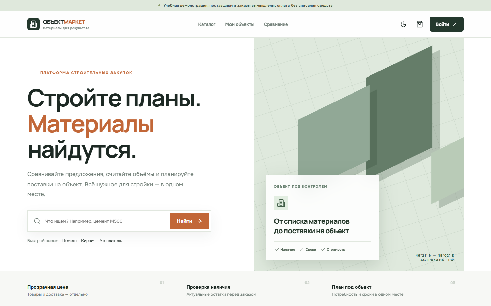

# ОбъектМаркет

«ОбъектМаркет» — дипломный проект информационной системы для подбора строительных материалов и планирования поставок на объект. Покупатель сравнивает предложения поставщиков, рассчитывает потребность и оформляет заказ. Поставщик управляет ценой и остатками, диспетчер назначает рейс, водитель отмечает этапы доставки.



[Каталог](docs/screenshots/catalog.png) · [Закупка для объекта](docs/screenshots/project-detail.png)

Демонстрационные товары, организации и заказы вымышлены. Подтверждение оплаты меняет учебный статус заказа; деньги не списываются. Движение автомобиля на карте моделируется без GPS.

## Запуск

Нужен Docker с Compose. На свободном порту 3000 выполните:

```bash
cp .env.example .env
docker compose up --build -d
```

На Windows скопируйте файл `.env.example` в `.env` любым удобным способом. Перед запуском задайте свой `POSTGRES_PASSWORD` в `.env`. Сайт будет доступен по адресу [localhost:3000](http://localhost:3000). Описание методов находится в [OpenAPI](api/openapi.yaml). Первый запуск применяет миграции и загружает демоданные. Для просмотра журналов: `docker compose logs --tail=100 api web db`.

Ключи 2ГИС и DaData не обязательны. Без них работают локальные подсказки адресов и схема демонстрационного маршрута. Порядок подключения сервисов описан в [инструкции по развёртыванию](docs/DEPLOY.md).

## Демонстрационные учётные записи

Для всех записей пароль `Demo2026!`.

| Роль | Логин |
| --- | --- |
| Покупатель | `buyer@example.test` |
| Поставщик | `supplier@example.test` |
| Второй поставщик | `supplier2@example.test` |
| Диспетчер | `dispatcher@example.test` |
| Водитель | `driver@example.test` |
| Администратор | `admin@example.test` |

Начать удобно с покупателя: открыть каталог, добавить предложения в корзину, выбрать адрес и оформить заказ. После учебного подтверждения оплаты можно войти как диспетчер и водитель, чтобы пройти поставку до завершения.

## Состав проекта

- `web/` — Next.js, React и TypeScript; адаптивный интерфейс и клиентские калькуляторы.
- `api/` — NestJS API, OpenAPI, миграции и загрузка демоданных.
- `docs/` — руководство, архитектура, испытания и материалы защиты.

Хранение данных — PostgreSQL. Денежные суммы передаются в копейках и фиксируются в заказе. При оформлении остатки проверяются и резервируются внутри транзакции; повтор запроса с тем же ключом не создаёт второй заказ.

## Документация

- [Руководство пользователя](docs/USER_GUIDE.md)
- [Архитектура](docs/ARCHITECTURE.md), [модель данных](docs/DATA_MODEL.md) и [контракт API](docs/API_CONTRACT.md)
- [Запуск и развёртывание](docs/DEPLOY.md)
- [Постановка задачи и аналоги](docs/RESEARCH.md)
- [План испытаний](docs/TEST_PLAN.md) и [результаты локальной проверки](docs/TEST_RESULTS.md)
- [Материалы защиты](docs/DEFENSE.md)
- [Пояснительная записка](docs/vkr/Пояснительная_записка_ОбъектМаркет.docx), [презентация](docs/presentation/output/ОбъектМаркет_Защита_ВКР.pptx), [текст доклада](docs/SPEECH.md) и [графические листы](docs/graphic-sheets/)

Исходный код распространяется по лицензии [MIT](LICENSE).
