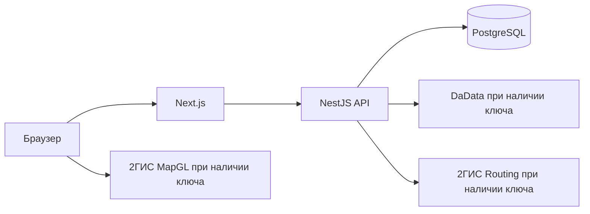

# Архитектура системы

## Компоненты

Браузер открывает интерфейс Next.js. Запросы `/api/v1` проксируются к NestJS API; браузер не обращается к базе данных или ключам внешних сервисов. API выполняет проверку пользователя и роли, предметные правила и запросы к PostgreSQL. Миграции задают схему, а повторяемая команда загрузки демоданных готовит учебный сценарий.

При отсутствии ключей адреса и маршруты берутся из локального учебного набора. Интерфейс явно помечает этот режим. Платёжный переход меняет статус учебного заказа и не вызывает банк. Траектория машины проигрывается по маршруту, но не описывается как GPS.

## Предметная модель

Каталог разделяет товар и предложение поставщика: один материал может продаваться несколькими организациями по разной цене и с разными остатками. Остаток относится к складу, а потребность — к объекту и требуемому этапу. При оформлении заказ фиксирует выбранные предложения, цену и адрес; поставки группируются по поставщику. Заказ и поставка имеют отдельные допустимые переходы статусов.

Расчёт предложения читает цены и доступность без резервирования. Оформление заново проверяет условия внутри транзакции и резервирует количество. Это защищает от продажи одного остатка нескольким покупателям. Повтор запроса с тем же ключом идемпотентности возвращает ранее созданный заказ.

## Границы версии

Реальные платежи, GPS и договоры с поставщиками отсутствуют. Их интерфейсы отделены от учебной симуляции. Прототип служит для демонстрации процессов и проверки алгоритма, а не содержит реальные коммерческие предложения.
