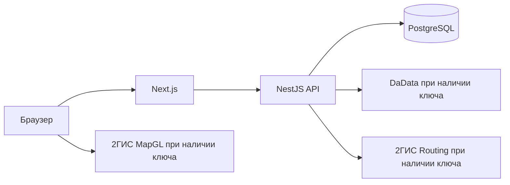

# Архитектура системы

## Компоненты

Браузер открывает интерфейс Next.js. Запросы `/api/v1` проксируются к NestJS API; браузер не обращается к базе данных. Ключи DaData и маршрутизации использует API, а публичный ключ MapGL передаётся браузеру для карты. API выполняет проверку пользователя и роли, предметные правила и запросы к PostgreSQL. Миграции задают схему, а повторяемая команда загрузки демоданных готовит учебный сценарий.

При оформлении выбранная адресная подсказка передаёт точку заказа. Ручная правка текста снимает эту точку; заказ без координат допустим. Поставка сохраняет снимок всех складов выбранных предложений. Карта покупателя и водителя читает эти данные и запрашивает участок «выбранный склад → точка заказа». Внешний запрос не выполняется внутри транзакции резервирования. Смена участка отменяет прежний запрос и скрывает устаревшую геометрию.

Без ключей доступны локальные подсказки и подписанная схема между переданными точками. Координатная сетка не заменяет дорожную карту, расстояние и время не выдумываются. Ошибка сервиса показывается с возможностью повтора. Несколько складов можно переключать, но порядок объезда не оптимизируется. Адрес объекта пока хранится текстом; точка выбирается при оформлении. GPS и движения автомобиля нет, этапы рейса водитель отмечает вручную. Платёж меняет статус без обращения к банку. Работа 2ГИС и DaData с действующими ключами ещё не проверена.

## Предметная модель

Каталог разделяет товар и предложение поставщика: один материал может продаваться несколькими организациями по разной цене и с разными остатками. Остаток относится к складу, а потребность — к объекту и требуемому этапу. При оформлении заказ фиксирует выбранные предложения, цену и адрес; поставки группируются по поставщику. Заказ и поставка имеют отдельные допустимые переходы статусов.

Расчёт предложения читает цены и доступность без резервирования. Оформление заново проверяет условия внутри транзакции и резервирует количество. Это защищает от продажи одного остатка нескольким покупателям. Повтор запроса с тем же ключом идемпотентности возвращает ранее созданный заказ.

Таблицы и связи подробно описаны в [модели данных](DATA_MODEL.md). Исходный SQL находится в `api/migrations`.

Калькулятор для объекта выбирает конкретный товар. Упаковка хранится в структурированном поле; клиент передаёт площадь, норму расхода и запас. Сервер пересчитывает число единиц при добавлении в перечень. Повтор добавления с тем же ключом не создаёт вторую строку, а удаление строки сохраняет запрет старого повтора. Ключ и позиция записываются одной транзакцией; PostgreSQL advisory lock сериализует параллельные запросы одного ключа. Единицы, формулы и совместимость прежних данных описаны в [правилах расчёта](MATERIAL_CALCULATIONS.md).

## Границы версии

Реальные платежи, GPS и договоры с поставщиками отсутствуют. Учебная поставка отражает ручные переходы статусов; карта не предназначена для навигации. Прототип служит для демонстрации процессов и проверки алгоритма, а не содержит реальные коммерческие предложения.
