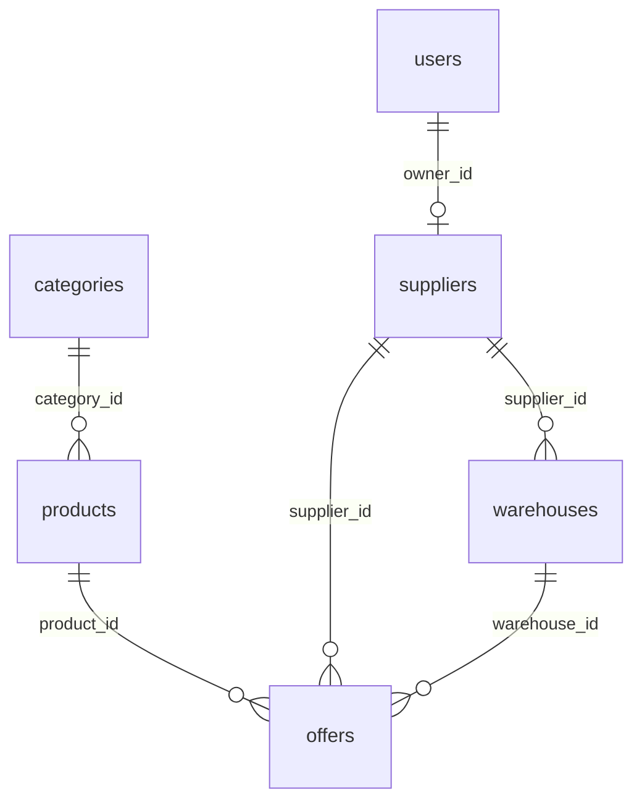
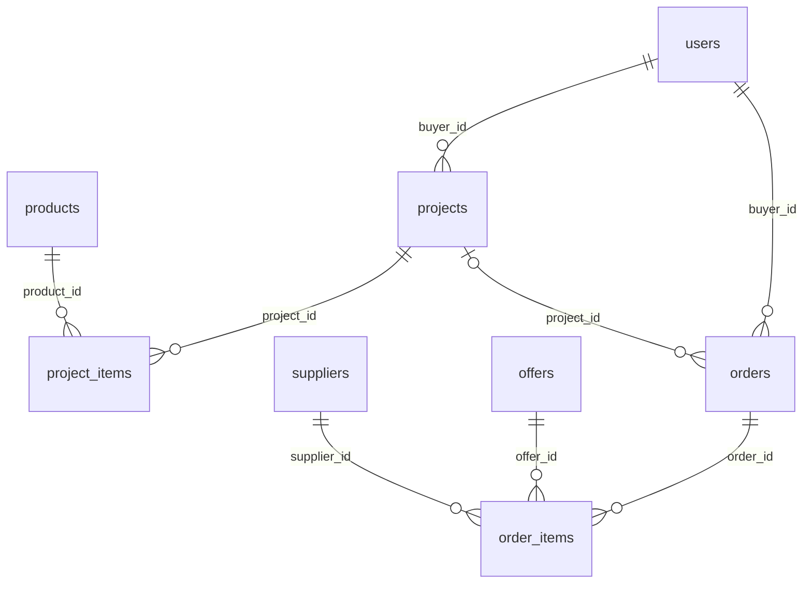
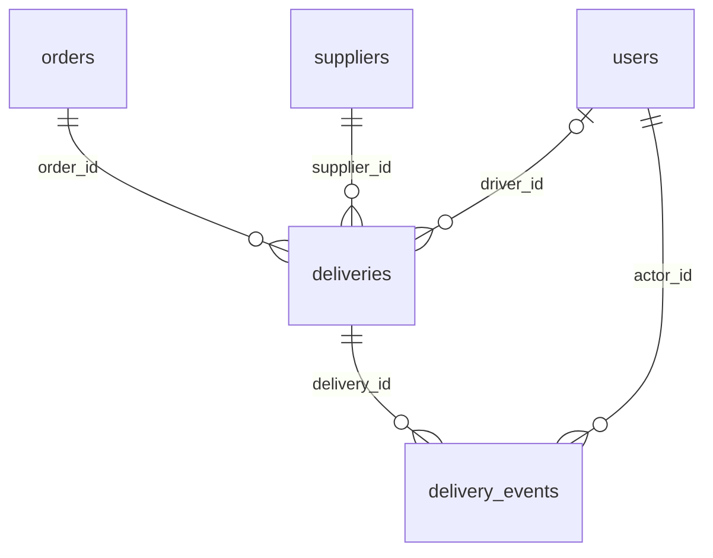
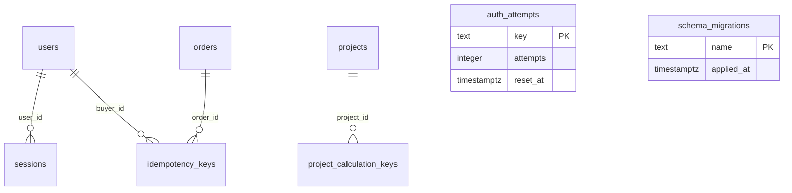

# Модель данных

Схема PostgreSQL 17 содержит 17 таблиц: 12 предметных и пять служебных. Она создаётся [миграциями 001–006](../api/migrations); журнал применённых файлов создаёт [скрипт миграций](../api/scripts/migrate.ts). Денежные суммы хранятся в целых копейках, количество — в единицах продажи товара. `offers.stock` означает доступное количество после вычета резервов.

## Предметная модель

Товар описывает материал и фасовку, предложение — цену и условия конкретного поставщика и склада. Поэтому у одной карточки может быть несколько предложений. Поставщик имеет профиль, связанный с пользователем; водитель и диспетчер представлены ролями пользователя.

Объект хранит плановую потребность. Позиция объекта ссылается на товар и дату этапа, но не резервирует остаток. Заказ фиксирует выбранные предложения, коммерческие условия и адрес. API создаёт отдельную поставку для каждого поставщика заказа. События поставки составляют историю действий водителя.

В диаграммах ниже показаны реальные внешние ключи. `||` означает обязательного единственного родителя, `|o` — необязательного, `o{` — от нуля до нескольких зависимых строк. Наличие внешнего ключа само по себе не требует, чтобы у родителя были зависимые записи.

### Каталог

### Потребность и заказ

Заказ без объекта допустим: `orders.project_id` может быть пустым. Дата заказа — одно пожелание покупателя. Для закупки по этапам пользователь может оформить несколько заказов; схема не связывает даты строк ведомости с датой заказа автоматически.

### Исполнение поставки

До назначения `driver_id` пуст. Роли покупателя, поставщика и водителя проверяет API: внешние ключи на `users` подтверждают существование пользователя, но не его роль. Последовательность событий `assigned → picked_up → in_transit → delivered` также проверяется обработчиком API; у `delivery_events.status` нет отдельного CHECK.

### Служебные записи

`sessions` хранит хеш токена и срок действия; сам токен передаётся в HttpOnly cookie. `auth_attempts` содержит счётчики ограничения попыток входа, а `schema_migrations` — имена применённых SQL-файлов.

Ключ повторного заказа уникален в пределах покупателя и связан с хешем запроса и оформленным заказом. Ключ добавления расчёта уникален в пределах объекта и хранит снимок ответа. У `project_calculation_keys.item_id` намеренно нет внешнего ключа: после удаления позиции старый повтор не должен создавать её заново. Ключ удаляется вместе с объектом.

## Снимки и остатки

| Текущее значение | Сохранённое значение | Последующая правка |
| --- | --- | --- |
| Название и единица товара, цена предложения | `order_items.product_name`, `unit`, `price_kopecks` | Не меняет позиции оформленного заказа |
| Выбранная точка адреса | `orders.destination_lon`, `destination_lat` | Остаётся в заказе; ручной адрес может не иметь точки |
| Склады выбранных предложений | `deliveries.departure_points` | Имя, адрес и координаты сохраняются при оформлении и не обновляются из справочника |
| Доступное количество предложения | `offers.stock` | Уменьшается при резервировании; отмена и истечение неоплаченного резерва возвращают количество |

Неоплаченный резерв действует 30 минут. Его срок хранится в заказе; отдельной таблицы физического остатка или резерва нет. Оплата сохраняет уже выполненное списание доступного количества. Истечение обрабатывается кодом операций с заказами, а не таймером PostgreSQL. Расчёт стоимости без создания заказа не резервирует товар.

Координаты назначения должны быть заполнены парой и находиться в допустимых диапазонах. Для массива точек отправления БД проверяет форму объектов, UUID, строки и координаты. Это снимок: `warehouseId` внутри JSON не является внешним ключом и не требует сохранения строки склада. Прежние заказы получают пустые координаты, прежние поставки — пустой массив. Поле `route` сохраняет совместимость со старой схемой; новые заказы не записывают в него выдуманный маршрут.

## Гарантии БД и правила API

БД проверяет ключи, существование связанных строк, уникальность email и slug, положительное количество и неотрицательный доступный остаток. Транзакция оформления блокирует предложения, повторно проверяет условия, создаёт заказ и поставки и уменьшает запас атомарно.

Следующие согласования выполняет API:

- выбранный склад принадлежит поставщику предложения;
- пользователь имеет нужную роль и право работать с объектом или предложением;
- поставщик позиции заказа взят из выбранного предложения;
- стоимость заказа совпадает с рассчитанными позициями и доставкой;
- при создании заказа сформирована одна поставка на каждого поставщика;
- назначение выполняется после оплаты, события идут в допустимом порядке.

Раздельные FK `offers.supplier_id` и `offers.warehouse_id` не образуют составного ограничения принадлежности склада. У заказов нет CHECK пересчёта итогов из позиций, у поставок нет UNIQUE `(order_id, supplier_id)`. Эти свойства обеспечивает маршрут создания заказа. Структуру фасовки JSONB проверяет сервер; географические ограничения координат склада не заданы в DDL.

## Физическая схема

Ниже приведены поля актуальной схемы после шести миграций. `NULL` означает необязательное значение, `NOT NULL` — обязательное. PK, UNIQUE, FK и CHECK перечислены после соответствующей таблицы. Если ON DELETE не указан, применяется PostgreSQL NO ACTION. Каскадное удаление задано только для сеансов пользователя, позиций объекта и ключей его расчётов.

### Каталог и пользователи

#### `users`

| Поле | Тип PostgreSQL | Допускает NULL | Значение по умолчанию |
| --- | --- | --- | --- |
| `id` | `uuid` | Нет | `gen_random_uuid()` |
| `name` | `text` | Нет | — |
| `email` | `text` | Нет | — |
| `password_hash` | `text` | Нет | — |
| `role` | `text` | Нет | — |
| `created_at` | `timestamp with time zone` | Нет | `now()` |

Ограничения:

- `UNIQUE (email)`
- `PRIMARY KEY (id)`
- `CHECK ((role = ANY (ARRAY['buyer'::text, 'supplier'::text, 'dispatcher'::text, 'driver'::text, 'admin'::text])))`

#### `suppliers`

| Поле | Тип PostgreSQL | Допускает NULL | Значение по умолчанию |
| --- | --- | --- | --- |
| `id` | `uuid` | Нет | `gen_random_uuid()` |
| `name` | `text` | Нет | — |
| `owner_id` | `uuid` | Нет | — |

Ограничения:

- `FOREIGN KEY (owner_id) REFERENCES users(id)`
- `UNIQUE (owner_id)`
- `PRIMARY KEY (id)`

#### `warehouses`

| Поле | Тип PostgreSQL | Допускает NULL | Значение по умолчанию |
| --- | --- | --- | --- |
| `id` | `uuid` | Нет | `gen_random_uuid()` |
| `supplier_id` | `uuid` | Нет | — |
| `name` | `text` | Нет | — |
| `address` | `text` | Нет | — |
| `lon` | `numeric(9,6)` | Да | — |
| `lat` | `numeric(9,6)` | Да | — |

Ограничения:

- `PRIMARY KEY (id)`
- `FOREIGN KEY (supplier_id) REFERENCES suppliers(id)`

#### `categories`

| Поле | Тип PostgreSQL | Допускает NULL | Значение по умолчанию |
| --- | --- | --- | --- |
| `id` | `uuid` | Нет | `gen_random_uuid()` |
| `name` | `text` | Нет | — |
| `slug` | `text` | Нет | — |

Ограничения:

- `PRIMARY KEY (id)`
- `UNIQUE (slug)`

#### `products`

| Поле | Тип PostgreSQL | Допускает NULL | Значение по умолчанию |
| --- | --- | --- | --- |
| `id` | `uuid` | Нет | `gen_random_uuid()` |
| `category_id` | `uuid` | Нет | — |
| `slug` | `text` | Нет | — |
| `name` | `text` | Нет | — |
| `unit` | `text` | Нет | — |
| `image_url` | `text` | Да | — |
| `description` | `text` | Нет | `''::text` |
| `specs` | `jsonb` | Нет | `'{}'::jsonb` |
| `packaging` | `jsonb` | Да | — |

Ограничения:

- `FOREIGN KEY (category_id) REFERENCES categories(id)`
- `PRIMARY KEY (id)`
- `UNIQUE (slug)`

#### `offers`

| Поле | Тип PostgreSQL | Допускает NULL | Значение по умолчанию |
| --- | --- | --- | --- |
| `id` | `uuid` | Нет | `gen_random_uuid()` |
| `product_id` | `uuid` | Нет | — |
| `supplier_id` | `uuid` | Нет | — |
| `warehouse_id` | `uuid` | Нет | — |
| `price_kopecks` | `integer` | Нет | — |
| `stock` | `integer` | Нет | — |
| `delivery_days` | `integer` | Нет | — |
| `delivery_cost_kopecks` | `integer` | Нет | — |
| `active` | `boolean` | Нет | `true` |

Ограничения:

- `CHECK ((delivery_cost_kopecks >= 0))`
- `CHECK ((delivery_days >= 0))`
- `PRIMARY KEY (id)`
- `CHECK ((price_kopecks > 0))`
- `FOREIGN KEY (product_id) REFERENCES products(id)`
- `UNIQUE (product_id, warehouse_id)`
- `CHECK ((stock >= 0))`
- `FOREIGN KEY (supplier_id) REFERENCES suppliers(id)`
- `FOREIGN KEY (warehouse_id) REFERENCES warehouses(id)`

### Планирование и закупка

#### `projects`

| Поле | Тип PostgreSQL | Допускает NULL | Значение по умолчанию |
| --- | --- | --- | --- |
| `id` | `uuid` | Нет | `gen_random_uuid()` |
| `buyer_id` | `uuid` | Нет | — |
| `name` | `text` | Нет | — |
| `address` | `text` | Нет | — |
| `stages` | `jsonb` | Нет | `'[]'::jsonb` |
| `created_at` | `timestamp with time zone` | Нет | `now()` |

Ограничения:

- `FOREIGN KEY (buyer_id) REFERENCES users(id)`
- `PRIMARY KEY (id)`

#### `project_items`

| Поле | Тип PostgreSQL | Допускает NULL | Значение по умолчанию |
| --- | --- | --- | --- |
| `id` | `uuid` | Нет | `gen_random_uuid()` |
| `project_id` | `uuid` | Нет | — |
| `product_id` | `uuid` | Нет | — |
| `quantity` | `integer` | Нет | — |
| `stage_date` | `date` | Да | — |

Ограничения:

- `PRIMARY KEY (id)`
- `FOREIGN KEY (product_id) REFERENCES products(id)`
- `FOREIGN KEY (project_id) REFERENCES projects(id) ON DELETE CASCADE`
- `CHECK ((quantity > 0))`

#### `orders`

| Поле | Тип PostgreSQL | Допускает NULL | Значение по умолчанию |
| --- | --- | --- | --- |
| `id` | `uuid` | Нет | `gen_random_uuid()` |
| `buyer_id` | `uuid` | Нет | — |
| `project_id` | `uuid` | Да | — |
| `address` | `text` | Нет | — |
| `requested_date` | `date` | Да | — |
| `status` | `text` | Нет | `'awaiting_payment'::text` |
| `items_total_kopecks` | `bigint` | Нет | — |
| `delivery_total_kopecks` | `bigint` | Нет | — |
| `created_at` | `timestamp with time zone` | Нет | `now()` |
| `reservation_expires_at` | `timestamp with time zone` | Да | — |
| `destination_lon` | `double precision` | Да | — |
| `destination_lat` | `double precision` | Да | — |

Ограничения:

- `CHECK (((status <> 'awaiting_payment'::text) OR (reservation_expires_at IS NOT NULL)))`
- `FOREIGN KEY (buyer_id) REFERENCES users(id)`
- `CHECK ((((destination_lon IS NULL) AND (destination_lat IS NULL)) OR ((destination_lon IS NOT NULL) AND (destination_lat IS NOT NULL) AND ((destination_lon >= ('-180'::integer)::double precision) AND (destination_lon <= (180)::double precision)) AND ((destination_lat >= ('-90'::integer)::double precision) AND (destination_lat <= (90)::double precision)))))`
- `PRIMARY KEY (id)`
- `FOREIGN KEY (project_id) REFERENCES projects(id)`
- `CHECK ((status = ANY (ARRAY['awaiting_payment'::text, 'paid'::text, 'in_progress'::text, 'delivered'::text, 'cancelled'::text, 'expired'::text])))`

#### `order_items`

| Поле | Тип PostgreSQL | Допускает NULL | Значение по умолчанию |
| --- | --- | --- | --- |
| `id` | `uuid` | Нет | `gen_random_uuid()` |
| `order_id` | `uuid` | Нет | — |
| `offer_id` | `uuid` | Нет | — |
| `supplier_id` | `uuid` | Нет | — |
| `product_name` | `text` | Нет | — |
| `quantity` | `integer` | Нет | — |
| `price_kopecks` | `integer` | Нет | — |
| `unit` | `text` | Нет | — |

Ограничения:

- `FOREIGN KEY (offer_id) REFERENCES offers(id)`
- `FOREIGN KEY (order_id) REFERENCES orders(id)`
- `PRIMARY KEY (id)`
- `CHECK ((quantity > 0))`
- `FOREIGN KEY (supplier_id) REFERENCES suppliers(id)`

### Поставки

#### `deliveries`

| Поле | Тип PostgreSQL | Допускает NULL | Значение по умолчанию |
| --- | --- | --- | --- |
| `id` | `uuid` | Нет | `gen_random_uuid()` |
| `order_id` | `uuid` | Нет | — |
| `supplier_id` | `uuid` | Нет | — |
| `driver_id` | `uuid` | Да | — |
| `status` | `text` | Нет | `'pending'::text` |
| `scheduled_date` | `date` | Да | — |
| `route` | `jsonb` | Нет | `'[]'::jsonb` |
| `delivery_cost_kopecks` | `integer` | Нет | — |
| `departure_points` | `jsonb` | Нет | `'[]'::jsonb` |

Ограничения:

- `CHECK (valid_delivery_departure_points(departure_points))`
- `FOREIGN KEY (driver_id) REFERENCES users(id)`
- `FOREIGN KEY (order_id) REFERENCES orders(id)`
- `PRIMARY KEY (id)`
- `CHECK ((status = ANY (ARRAY['pending'::text, 'assigned'::text, 'picked_up'::text, 'in_transit'::text, 'delivered'::text, 'cancelled'::text])))`
- `FOREIGN KEY (supplier_id) REFERENCES suppliers(id)`

#### `delivery_events`

| Поле | Тип PostgreSQL | Допускает NULL | Значение по умолчанию |
| --- | --- | --- | --- |
| `id` | `uuid` | Нет | `gen_random_uuid()` |
| `delivery_id` | `uuid` | Нет | — |
| `actor_id` | `uuid` | Нет | — |
| `status` | `text` | Нет | — |
| `created_at` | `timestamp with time zone` | Нет | `now()` |

Ограничения:

- `FOREIGN KEY (actor_id) REFERENCES users(id)`
- `FOREIGN KEY (delivery_id) REFERENCES deliveries(id)`
- `PRIMARY KEY (id)`

### Служебные таблицы

#### `sessions`

| Поле | Тип PostgreSQL | Допускает NULL | Значение по умолчанию |
| --- | --- | --- | --- |
| `token_hash` | `text` | Нет | — |
| `user_id` | `uuid` | Нет | — |
| `expires_at` | `timestamp with time zone` | Нет | — |

Ограничения:

- `PRIMARY KEY (token_hash)`
- `FOREIGN KEY (user_id) REFERENCES users(id) ON DELETE CASCADE`

#### `auth_attempts`

| Поле | Тип PostgreSQL | Допускает NULL | Значение по умолчанию |
| --- | --- | --- | --- |
| `key` | `text` | Нет | — |
| `attempts` | `integer` | Нет | — |
| `reset_at` | `timestamp with time zone` | Нет | — |

Ограничения:

- `PRIMARY KEY (key)`

#### `idempotency_keys`

| Поле | Тип PostgreSQL | Допускает NULL | Значение по умолчанию |
| --- | --- | --- | --- |
| `buyer_id` | `uuid` | Нет | — |
| `key` | `text` | Нет | — |
| `request_hash` | `text` | Нет | — |
| `order_id` | `uuid` | Нет | — |

Ограничения:

- `FOREIGN KEY (buyer_id) REFERENCES users(id)`
- `FOREIGN KEY (order_id) REFERENCES orders(id)`
- `PRIMARY KEY (buyer_id, key)`

#### `project_calculation_keys`

| Поле | Тип PostgreSQL | Допускает NULL | Значение по умолчанию |
| --- | --- | --- | --- |
| `project_id` | `uuid` | Нет | — |
| `key` | `text` | Нет | — |
| `request_hash` | `text` | Нет | — |
| `item_id` | `uuid` | Нет | — |
| `response` | `jsonb` | Нет | — |

Ограничения:

- `PRIMARY KEY (project_id, key)`
- `FOREIGN KEY (project_id) REFERENCES projects(id) ON DELETE CASCADE`

#### `schema_migrations`

| Поле | Тип PostgreSQL | Допускает NULL | Значение по умолчанию |
| --- | --- | --- | --- |
| `name` | `text` | Нет | — |
| `applied_at` | `timestamp with time zone` | Нет | `now()` |

Ограничения:

- `PRIMARY KEY (name)`

## Учебный набор

`npm run seed` добавляет записи с постоянными UUID и сохраняет существующие. При чистом запуске создаются пять категорий, тринадцать материалов, два поставщика, два склада, объект и учебные заказы. Плитка в м² и коробках имеет разные ID и остатки. Набор можно дополнять через приложение; количество строк после таких изменений отличается от исходного seed. Повторная загрузка не стирает созданные пользователем записи. [Правила фасовки и совместимости](MATERIAL_CALCULATIONS.md).
