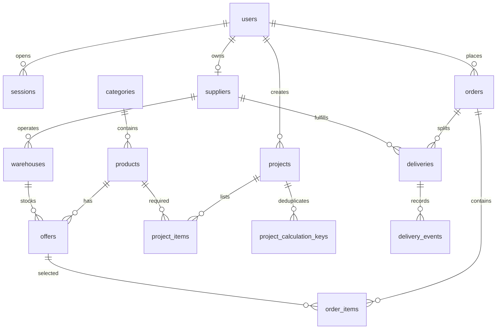

# Модель данных

Схема PostgreSQL создаётся миграциями в `api/migrations`. Для денежных сумм используются целые копейки; количество в предложении и заказе выражено целыми единицами товара. Координаты склада хранятся как долгота и широта.

## Основные связи

**Товар** описывает материал и его характеристики. Nullable JSONB `packaging` хранит фасовку: площадь и число плиток, литры ведра либо килограммы мешка. Единица и фасовка устанавливаются при создании; обычный PATCH их не меняет. Иная фасовка — отдельная карточка. **Предложение** связывает товар с поставщиком, складом, ценой, остатком и условиями доставки. Все предложения товара относятся к одной фасовке.

**Объект** принадлежит покупателю. Позиции объекта фиксируют потребность и дату этапа. Их изменение само по себе не резервирует склад. При оформлении **заказ** сохраняет снимок названия товара, единицы измерения, количества и цены, чтобы последующие изменения каталога не переписывали историю. Для каждого поставщика в заказе создаётся отдельная **поставка**.

**Сессия** хранит хеш случайного токена и срок действия. Токен передаётся в HttpOnly cookie. **Ключ идемпотентности** привязан к покупателю и хешу тела запроса: одинаковый повтор возвращает уже созданный заказ, а тот же ключ с другим содержимым отклоняется. Неоплаченный резерв действует 30 минут; отмена или истечение срока возвращает количество на склад внутри транзакции.

## Целостность заказа

`project_calculation_keys` хранит ключ добавления расчёта, хеш нормализованного запроса, ID позиции и снимок ответа. Ключ уникален внутри объекта. Ключ и позиция создаются одной транзакцией; параллельные повторы сериализуются. При удалении позиции ключ сохраняется до удаления объекта, поэтому старый повтор не создаёт позицию заново.

Перед оформлением сервер читает выбранные предложения и повторно проверяет цену и доступное количество. В транзакции он блокирует строки остатков, создаёт заказ и поставки и уменьшает остатки. Ограничение `stock >= 0` остаётся дополнительной защитой на уровне базы. Предварительный расчёт доступен без резерва и может устареть, поэтому окончательные значения берутся из транзакции оформления.

## Демоданные

Команда `npm run seed` в каталоге `api` добавляет предопределённые записи с постоянными UUID и пропускает уже существующие. В наборе есть пять категорий, тринадцать материалов, два поставщика, два склада, объект покупателя, учебные заказы и рейсы. Плитка в м² и коробках имеет разные ID и остатки. Повторный запуск сохраняет созданные пользователем записи и заказы. Порядок обновления единиц описан в [документе расчётов](MATERIAL_CALCULATIONS.md).
