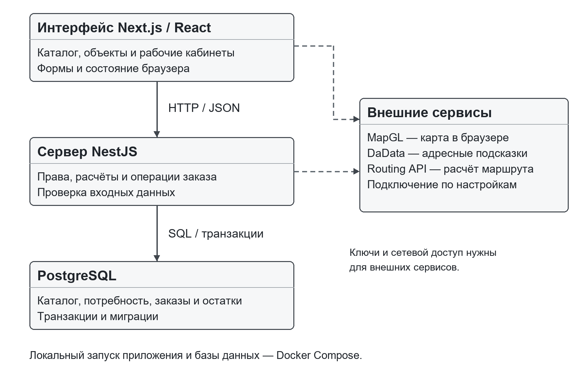
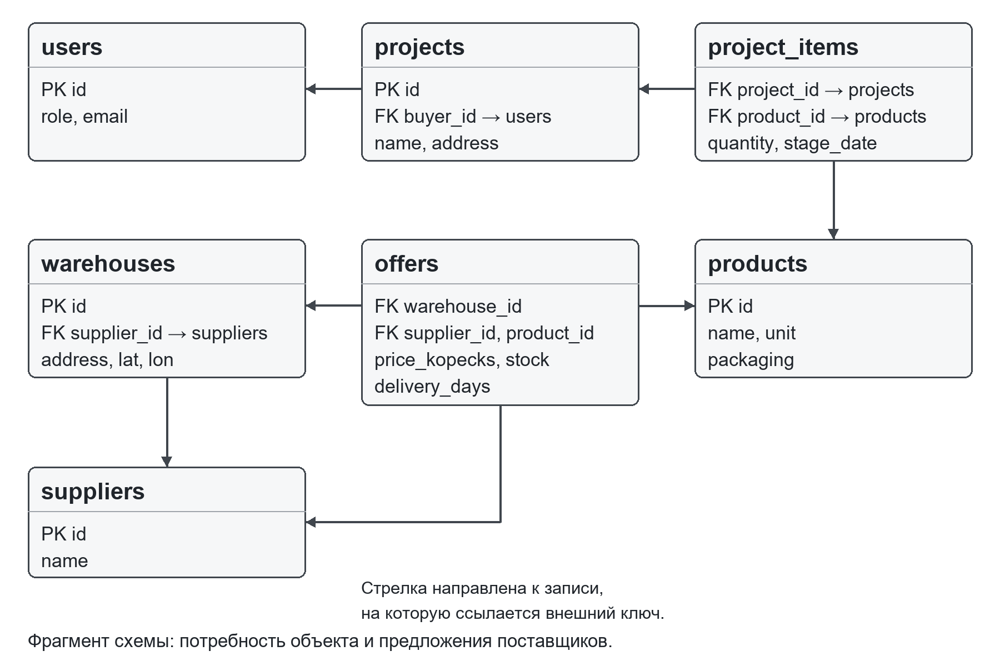
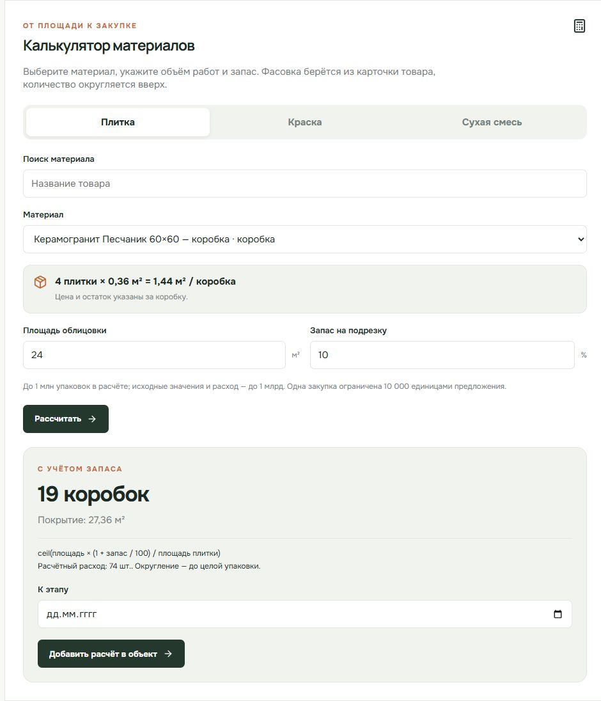
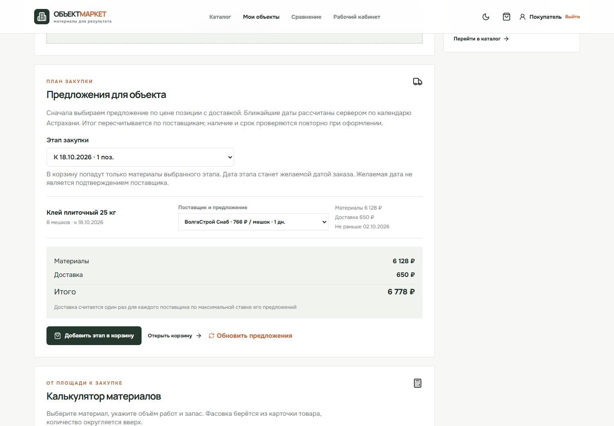

# РЕФЕРАТ

Работа посвящена разработке информационной системы снабжения строительного объекта. Основной пользователь — снабженец или прораб небольшой организации. Реализованы каталог, предложения поставщиков, импорт ведомости, расчёт упаковок, закупка по этапам, заказ с резервированием остатков и сопровождение поставки. Стоимость материалов и доставки показана отдельно. Поставщик управляет предложениями, диспетчер назначает водителя, водитель вручную отмечает события рейса.

Программная часть использует TypeScript, Next.js, NestJS и PostgreSQL. Схема создаётся миграциями, HTTP API описан в OpenAPI; запуск выполняется через Docker Compose. Для воспроизводимых примеров подготовлены вымышленные данные Астраханской области. Тестовая оплата не списывает деньги. Схема карты соединяет фиксированные точки, не привязана к адресу заказа и не показывает движение автомобиля. GPS отсутствует. Подключение 2ГИС и DaData предусмотрено в коде, но с действующими ключами не проверено.

Цель — разработать и технически проверить функциональный прототип закупки материалов для объекта. Рассмотрены аналоги, сформулированы требования, описаны модель данных, расчёты и архитектура. Автоматические и ручные проверки охватывают основной процесс и ошибки ввода. Сравнительное измерение времени закупки, испытание с пользователями и оценка экономического эффекта не проводились.

Ключевые слова: строительные материалы, информационная система, маркетплейс, строительный объект, закупка, поставка, каталог, PostgreSQL, Next.js, NestJS.

# СОДЕРЖАНИЕ

Содержание формируется автоматически полем Word. После окончательного согласования титульного листа обновите поле содержания в Microsoft Word.

# ВВЕДЕНИЕ

Закупка строительных материалов начинается раньше размещения заказа. Основной пользователь рассматриваемого процесса — снабженец или прораб небольшой строительной организации: для конкретного объекта ему требуется определить количество и единицу измерения, связать материал с этапом работ, проверить доступность товара у поставщика и оценить доставку к нужной дате. Если эти сведения находятся в разных таблицах, переписке и каталогах, итоговая стоимость становится понятна поздно, а ошибку в остатке приходится исправлять уже после согласования закупки. Обычная покупка частным пользователем остаётся дополнительным сценарием.

Существующие торговые площадки предлагают поиск, сравнение предложений и работу со сметами. Поэтому предмет данной работы — не создание нового вида рынка и не доказательство отсутствия аналогов. В центре работы находится связанный пользовательский процесс: потребность объекта преобразуется в проверяемый заказ с учётом доступного остатка, стоимости материалов и доставки, а затем — в план поставок. Такая постановка соответствует задачам направления «Информационные системы и технологии в строительстве и архитектуре», поскольку данные объекта и этапов строительства влияют на решение о закупке.

Объект исследования — процесс выбора и поставки материалов для строительного объекта. Предмет исследования — методы представления потребности, сопоставления предложений поставщиков, проверки складских остатков и сопровождения заказа в информационной системе. Цель выпускной квалификационной работы — разработать работающий прототип этой системы и проверить сквозной сценарий на заранее определённых учебных данных.

Для достижения цели решаются следующие задачи. Изучается процесс закупки и функции действующих сервисов. Формируются роли пользователей и требования к данным. Проектируется модель каталога, предложений, объектов, заказов и поставок. Реализуются расчёты материалов с округлением до упаковок, серверная проверка цены и остатка, транзакционное оформление заказа и допустимые переходы статусов. Создаётся адаптивный интерфейс, в котором обычная покупка и закупка для объекта образуют понятные маршруты. Подготавливаются демоданные, документация, автоматические и ручные сценарии испытания.

В работе применяются анализ предметной области и аналогов, моделирование данных и процессов, проектирование клиент серверного приложения, проверка граничных условий расчётов, интеграционные и сквозные испытания. Источниками служат научные публикации по строительной логистике, открытые страницы сравниваемых сервисов и официальная документация технологий [1–21]. Результат проверяется на учебных сценариях; он не подменяется заявлением об экономическом эффекте для реальной организации.

Пояснительная записка состоит из аналитической и проектной частей. В аналитической части определяются задачи пользователя и пределы сравнения с аналогами. Проектная часть описывает архитектуру, базу данных, алгоритмы, интерфейс и испытания. В заключении перечислены полученные результаты и ограничения. Приложения содержат справочные таблицы, входные данные и протоколы, необходимые для воспроизведения демонстрации.

# 1 АНАЛИТИЧЕСКАЯ ЧАСТЬ

## 1.1 Особенности закупки материалов для строительного объекта

Номенклатура строительных материалов неоднородна. Цемент продают мешками, краску — в вёдрах определённого объёма, плитку — квадратными метрами или коробками, древесину — листами и штуками. Потребность на объекте возникает в одних единицах, а коммерческое предложение задаёт другие. Даже при совпадении названия товара выбор зависит от расхода, класса материала, размера упаковки, толщины слоя и допустимого запаса. Следовательно, карточка товара должна содержать характеристики, а калькулятор — показывать исходные предположения и формулу.

Для строительного объекта важна дата использования материала. Поставка слишком поздно задерживает работы, а слишком ранняя требует места для хранения и может привести к повреждению товара. В научной литературе проблемы снабжения рассматриваются как часть организации строительного процесса. Ala-Risku и Kärkkäinen связывают нарушения поставки с условиями строительной площадки и координацией участников [1]. Abdzadeh, Noori и Ghannadpour рассматривают взаимосвязь выбора поставщика, графика и маршрутизации [2]. Эти работы обосновывают состав рассматриваемых данных, но не доказывают эффективность именно разработанной системы.

В упрощённом процессе покупатель находит товар, вводит количество, получает цену и оформляет заказ. Для объекта необходим дополнительный контекст: название и адрес объекта, список материалов, этапы и сроки, возможность импортировать подготовленную ведомость, сравнить поставщиков и увидеть разбивку на поставки. При этом профессиональный сценарий не должен мешать обычному заказу. Пользователь без объекта вправе сразу перейти от каталога к корзине.

Цена товара без доставки не всегда характеризует итоговую стоимость. Два предложения могут отличаться сроком и стоимостью перевозки; одна позиция может быть доступна у нескольких продавцов и на разных складах. Введённая в прототипе оценка показывает стоимость товара и доставки отдельно, а общий итог складывается из выбранных предложений. Для каждой группы одного поставщика доставка учитывается один раз по наибольшей ставке среди выбранных предложений этого поставщика. Это прозрачное учебное правило расчёта, а не тарифная модель транспортной компании или решение задачи глобальной оптимизации.

Отдельное требование возникает из изменчивости остатков. Расчёт, показанный до оформления, может устареть, пока другой покупатель оформляет заказ. Поэтому окончательное оформление выполняется сервером с повторной проверкой и резервированием в транзакции. Представление предварительного расчёта и операции заказа как одного и того же состояния привело бы к двойной продаже остатка.

## 1.2 Участники и границы процесса

Покупатель просматривает каталог без входа, формирует корзину и сравнение, а после входа создаёт объект и заказ. Поставщик изменяет собственные предложения и остатки. Диспетчер видит поставки и назначает водителя. Водитель меняет состояние только назначенного ему рейса. Администратор поддерживает справочники и просматривает учебную сводку. Разделение ролей необходимо для предотвращения изменения чужих данных и для ясного распределения действий в демонстрации.

Объект пользователя представляет контекст потребности, а не цифровую модель здания. В нём хранятся название, адрес, этапы и позиции материалов. Эта модель достаточна для проверки выбранной исследовательской задачи. Интеграция с BIM, бухгалтерией, системой электронного документооборота и договорами поставщиков выходит за рамки работы. Такие функции нельзя обозначать как реализованные только потому, что модель допускает расширение.

Границы учётных операций также определены заранее. Подтверждение оплаты означает переход учебного заказа в следующий статус; реквизиты карты не вводятся, банковский провайдер не вызывается. Изменение статуса рейса выполняет водитель через интерфейс, а не устройство геопозиционирования. Координаты маршрута используются для визуальной демонстрации. Пользователь должен видеть эти оговорки рядом с действием, иначе презентация создаст неверное впечатление о возможностях системы.

## 1.3 Анализ действующих решений

Для сравнения выбраны открытые сервисы, близкие по назначению. СтройОнли предоставляет каталог, поиск и сравнение цен; на публичной странице предлагается загрузить смету [3]. ЛОГИ описывает работу с каталогом, комплектацию по смете с участием специалиста и доставку на объект [4]. Строймаркет ориентирован на взаимодействие организаций и поставщиков [5]. Интернет магазин «Петрович» служит ориентиром по качеству витрины, карточки и покупки [6]. Состав функций устанавливается по публичным страницам на дату обращения. Отсутствие функции в сравнительной таблице означает только отсутствие подтверждения в использованном источнике.

| Решение | Подтверждённые возможности | Вывод для проектирования |
| СтройОнли | Каталог, сравнение цен, загрузка сметы | Сравнение и импорт уже ожидаются пользователем |
| ЛОГИ | Комплектация по смете и доставка | Требуется показать связь ведомости и поставки |
| Строймаркет | B2B каталог и связь с продавцами | Разделение ролей помогает описать процесс |
| Петрович | Развитая витрина и сервисы покупки | Удобство обычного заказа — обязательная основа |

Сравнение не сводится к количеству галочек. Функция может существовать на площадке в ином сценарии, быть доступна только партнёрам или зависеть от региона. Поэтому вывод сформулирован осторожно: существующие решения подтверждают востребованность каталога, сравнения и работы со сметой, а для учебной ВКР полезно реализовать связанный и измеримый процесс, в котором исходные параметры расчёта, выбранный поставщик, остаток и статус поставки доступны в одном стенде.

Оригинальность работы состоит в проектировании и реализации конкретной информационной системы, а не в исключительном праве на идею маркетплейса. Основное отличие демонстрационного сценария — самостоятельное формирование потребности объекта с видимыми формулами и последующее оформление заказа, разделённого по поставщикам. Проверяемость обеспечивается открытым описанием правил и воспроизводимыми входными данными.

## 1.4 Постановка задачи

Система должна обеспечивать два пользовательских маршрута. Первый — обычная покупка через каталог, карточку, корзину и оформление. Второй — подготовка закупки для объекта: запись потребности, при необходимости импорт ведомости, расчёт количества, выбор предложений и оформление с привязкой к объекту. После оформления пользователь наблюдает состояния заказа и поставок. Сотрудники демонстрационной организации выполняют свои действия в отдельных интерфейсах.

Входными данными служат товары и характеристики, предложения поставщиков, сведения о складах и остатках, адрес объекта, количество, этапы и выбранная дата. Выходными данными являются расчёт количества упаковок, состав корзины, предварительная стоимость, заказ, отдельные поставки и история событий. Для демонстрационного режима предусмотрены собственные адреса и статичная схема между фиксированными точками. Подключение DaData и 2ГИС предусмотрено в коде, но работа с действующими ключами не проверялась [7–9].

Критерием работоспособности служит прохождение сквозного сценария от выбора материала до завершённой учебной поставки. Для корректности данных важнее набор инвариантов: остаток не бывает отрицательным, чужой заказ не раскрывается, повтор одинакового запроса не создаёт второй заказ, статус рейса меняется только в допустимом порядке, денежные величины не теряют копейки. Для качества интерфейса рассматриваются читаемость, доступность действий на разных экранах и понятность деморежима.

## 1.5 Функциональные требования

Открытая часть содержит короткую главную страницу, каталог с поиском, категориями и сортировкой, карточку товара с характеристиками и предложениями, сравнение, корзину и форму оформления. Пользователь видит цену за единицу, наличие, срок и стоимость доставки. Описание предложения не должно выводить вымышленную цену как реальную цену действующей компании: весь сид имеет демонстрационный характер.

Покупатель может зарегистрироваться, войти, создать объект, добавить позиции и этапы, применить калькуляторы для плитки, краски и сухой смеси, импортировать строки CSV или XLSX и получить предварительный расчёт. Ошибочные строки импорта должны быть показаны отдельно, без молчаливого изменения исходного файла. Оформленный заказ содержит снимок наименования, количества и цены, чтобы последующие изменения каталога не переписывали историю операции.

Поставщик работает только со своими складами и предложениями. Диспетчер назначает водителя на оплаченную в учебном смысле поставку. Водитель проходит последовательность «назначен», «забран», «в пути», «доставлен». Администратор изменяет категории и товары, просматривает сводку. Часть операций зависит от наличия данных: нельзя назначить рейс несуществующему водителю или оформить недоступный объём.

## 1.6 Нефункциональные требования и ограничения

Приложение запускается на локальном компьютере по инструкции с Docker Compose и PostgreSQL. Миграции создают схему независимо от ручной настройки базы. Повторная загрузка демонстрационных данных не должна стирать пользовательские изменения. HTTP API документируется в формате OpenAPI, что облегчает проверку контрактов. Основные расчёты покрываются тестами, а критический маршрут оформления проверяется сквозным сценарием.

Для защиты данных запросы к базе параметризуются, пароли хранятся в виде криптографических хешей, а пользовательские сеансы передаются в HttpOnly cookie. Доступ ограничивается ролью и принадлежностью объекта или предложения. Ошибки внешних сервисов нельзя скрывать под видом успешного ответа. Производственная эксплуатация потребует отдельного анализа угроз, журналирования, резервного копирования, юридического оформления деятельности и договоров с поставщиками. Эти задачи не объявляются выполненными в учебной версии.

Интерфейс проектируется для телефона, планшета и настольного экрана. Фильтры и навигация адаптируются к узкому экрану, формы остаются пригодными для ввода, таблицы не должны выталкивать всю страницу за границы окна. Светлая и тёмная темы и умеренные переходы помогают современному восприятию, однако движение не должно заменять информацию или делать управление зависимым от анимации. Ориентиром служат принципы WCAG 2.2 [21].

# 2 ПРОЕКТИРОВАНИЕ СИСТЕМЫ

## 2.1 Сценарии использования

Сценарий обычной покупки начинается на главной странице. Пользователь ищет материал, ограничивает результаты категорией и открывает карточку. На карточке одинаковый товар представлен один раз, а ниже показаны предложения разных поставщиков. После добавления предложения в корзину пользователь указывает адрес и дату, получает предварительный итог, авторизуется при необходимости и подтверждает заказ. Сервер заново проверяет наличие и стоимость: данные корзины сами по себе не становятся основанием для списания остатка.

Основной сценарий снабженца или прораба начинается с ведомости объекта и сроков этапов. Пользователь может внести материалы вручную или импортировать файл известного формата. Калькуляторы уточняют количество упаковок с учётом объёма работ и фасовки товара. Затем выбирается этап, сравниваются доступные предложения и создаётся заказ с одной желаемой датой. При заказе возникает одна запись покупки, но поставки отделяются по поставщикам. Обычная покупка частным пользователем остаётся дополнительным маршрутом.

Сценарий поставки использует уже оплаченный в деморежиме заказ. Диспетчер выбирает водителя и дату. Водитель видит назначенный рейс, подтверждает последовательные события, после чего покупатель видит изменившийся статус. Если заказ разбит на несколько поставок, он становится доставленным лишь после завершения всех поставок. Простое движение маркера на карте не является источником статуса.

| Роль | Просмотр | Изменение |
| Гость | Каталог, карточки, сравнение | Локальная корзина |
| Покупатель | Свои объекты и заказы | Объект, позиции, оформление, демооплата |
| Поставщик | Свои предложения и склады | Свои цены, остатки, условия |
| Диспетчер | Поставки и водители | Назначение рейса |
| Водитель | Назначенные рейсы | События собственного рейса |
| Администратор | Сводка и справочники | Категории и товары |

Таблица описывает границы пользовательских прав. Право на просмотр не выводится автоматически из права на изменение другого ресурса: поставщик не получает доступ к личному заказу покупателя только потому, что исполняет его поставку. При передаче данных API возвращает объём, достаточный для конкретного экрана.

## 2.2 Архитектура приложения

В браузере выполняется приложение Next.js на React и TypeScript [12, 15, 16]. Оно отвечает за маршруты интерфейса, формы, локальное состояние корзины и визуальное представление данных. Встроенный прокси пересылает запросы `/api/v1` к внутреннему адресу сервера. За браузером находится NestJS API [13, 14], который проверяет сеанс, роль и принадлежность данных, выполняет предметные правила и взаимодействует с PostgreSQL. База данных хранит товары, предложения, объекты, заказы и события. Компоненты разворачиваются с Docker Compose [19].

Граница между интерфейсом и API проходит по JSON контракту. Браузер не открывает прямое соединение с PostgreSQL и не должен получать серверные ключи DaData или маршрутизации. Ключ браузерной карты MapGL по природе виден клиенту, поэтому его ограничивают доменом в кабинете провайдера. Такое разделение уменьшает число мест, где находятся чувствительные настройки, и упрощает повторение сценария без внешних сервисов.

База данных выбрана реляционной, поскольку операции заказа затрагивают связанные сущности и требуют атомарности. PostgreSQL предоставляет ограничения, транзакции и блокировки строк [17, 18]. Схема меняется через последовательные SQL миграции, версия которых фиксируется в служебной таблице. Данные каталога и учебных пользователей добавляются отдельной командой, не меняющей уже существующие записи при повторе.

Поток данных разделяет отображение интерфейса, проверку прав и предметные операции сервера, а также хранение в PostgreSQL. Его общая схема приведена на рисунке 1.

В данной версии нет Redis. Его появление было бы оправдано при измеренной потребности в распределённом кэше, очереди заданий или управлении высокой нагрузкой, но учебный стенд с одной базой и небольшим каталогом от него не выигрывает. Отсутствие дополнительного компонента упрощает запуск на ноутбуке и объяснение архитектуры на защите.

## 2.3 Модель предметных данных

Категория объединяет товары по назначению. Товар содержит название, единицу продажи, описание и характеристики. Предложение связывает товар, поставщика и склад с ценой, остатком, сроком и стоимостью доставки. Поэтому изменение цены одним поставщиком не меняет карточку материала и не влияет на другого продавца. Склад принадлежит поставщику и имеет адрес и координаты; предложение относится к конкретному складу.

Объект принадлежит покупателю. Позиция объекта задаёт товар, количество и при необходимости дату этапа. Она является планом потребности, а не резервом. Заказ создаётся только при явном оформлении. Его позиции сохраняют выбранное предложение, имя товара на момент покупки, количество и цену. Поставка относится к заказу и одному поставщику; события фиксируют ход рейса. Отдельная таблица ключей идемпотентности обеспечивает безопасный повтор запроса оформления.

| Сущность | Основные поля | Существенное правило |
| users | id, email, password_hash, role | Уникальная почта, роль из закрытого набора |
| sessions | token_hash, user_id, expires_at | В БД хранится хеш токена, а не сам токен |
| products | category_id, slug, unit, specs | Один товар может иметь много предложений |
| offers | product_id, warehouse_id, price_kopecks, stock | Цена положительна, остаток неотрицателен |
| projects | buyer_id, address, stages | Объект принадлежит покупателю |
| project_items | project_id, product_id, quantity, stage_date | Количество положительно |
| orders | buyer_id, status, суммы | Итог фиксируется при оформлении |
| deliveries | order_id, supplier_id, status, route | Отдельная поставка на поставщика |
| delivery_events | delivery_id, actor_id, status | Событие не подменяет текущее состояние |

Рисунок 2 показывает связи пользователя, объекта и его потребности с товарами, предложениями, складами и поставщиками. Это поясняющий фрагмент модели, не полная ER-диаграмма.

Для денег используются целые копейки. Это исключает накопление двоичной ошибки при сложении десятичных цен, характерной для чисел с плавающей точкой. Цена предложения и стоимость доставки ограничены положительными или неотрицательными целыми величинами. Итоги заказа используют тип bigint, поскольку сумма нескольких строк может быть больше отдельной цены. Для пользовательского вывода число копеек делится на сто и форматируется в рублях; форматирование не изменяет значение, хранящееся на сервере.

Координаты представлены парой долгота — широта. Такая последовательность применяется в ответе API и должна быть одинаковой при вызове картографического сервиса, сохранении маршрута и отрисовке. Неявная перестановка координат — типичная ошибка, которая даёт географически неверный результат при формально корректном JSON. В демоданных координаты складов и схематического пути относятся к Астрахани.

## 2.4 Правила расчёта материалов

В пользовательском калькуляторе выбирается товар с фасовкой из базы данных. Для плитки расход с запасом делится на площадь плитки в упаковке и округляется вверх до целых коробок. Старые товары, продаваемые квадратными метрами, сохранены с прежней единицей и без фасовки; для расчёта добавлены отдельные товары-коробки, а их остатки и предложения не пересчитывают прежние остатки в м². Например, для 24 м² и запаса 10% демо-позиция «Песчаник» даёт ceil(26,4 / 1,44) = 19 коробок (покрытие 27,36 м²), а «Графит» — ceil(26,4 / 1,26) = 21 коробку (26,46 м²). Интерфейс показывает формулу, расход и фасовку выбранного товара.

Для краски входными данными являются площадь A, расход r в литрах на квадратный метр за слой, число слоёв k, объём упаковки V и запас p. Расход равен A · r · k · (1 + p / 100). Число упаковок равно ceil(расход / V). Норма расхода зависит от основания, инструмента и конкретного продукта; калькулятор не подменяет паспорт производителя. В учебном сценарии пользователь может изменить входную норму, а результат остаётся проверяемым.

Для сухой смеси учитывается площадь A, толщина слоя h в миллиметрах, норма r в килограммах на квадратный метр и миллиметр, масса упаковки M и запас p. Расход равен A · h · r · (1 + p / 100), число упаковок равно ceil(расход / M). Ошибка в единицах толщины даёт кратный промах, поэтому интерфейс и API указывают миллиметры явно. Входные параметры должны быть конечными положительными числами, а запас может быть нулевым. Число слоёв и количество плиток в упаковке должны быть целыми.

| Материал | Исходные данные | Расход | Упаковки |
| Плитка | A=10 м²; S=0,25 м²; N=12; p=10% | 44 шт. | 4 |
| Краска | A=35 м²; r=0,1 л/м²; k=2; V=5 л; p=10% | 7,7 л | 2 |
| Смесь | A=12 м²; h=5 мм; r=0,8 кг/м²·мм; M=25 кг; p=10% | 52,8 кг | 3 |

Примеры фиксируют расчётные случаи общих функций API и остаются независимыми от выбранных демонстрационных SKU. В частности, плиточный пример с площадью элемента и количеством элементов в упаковке не описывает товары-коробки «Песчаник» и «Графит», для которых используется фасовка из карточки товара. Все примеры не являются производственной нормой расхода. Если пользователь изменит тип материала, основание или способ нанесения, значения следует взять из технической документации на конкретный товар. Принцип работы калькулятора — сделать арифметику открытой, а не создать видимость точной сметы без необходимых измерений.

## 2.5 Предварительный расчёт и выбор предложения

Предварительный расчёт читает выбранные предложения, проверяет активность, наличие и количество и возвращает строки заказа. По каждой строке стоимость товара равна цене единицы в копейках, умноженной на количество. Стоимость доставки рассчитывается на группу одного поставщика; в текущем учебном правиле используется максимальная ставка среди включённых предложений. Итог заказа равен сумме товаров и сумме доставки по группам. Ответ содержит недоступные позиции и предупреждения, если выбранный срок не согласуется с указанными условиями.

В плане по этапу подбор предложений является эвристическим: по каждой позиции рассматриваются доступный остаток и срок, затем для расчёта используется выбранный набор. Он не ищет глобально оптимальную комбинацию всех складов и маршрутов. Расчёт не учитывает грузоподъёмность, объём, окна разгрузки, скидки, перевозчика, дорожные ограничения или реальные тарифные зоны. Применение слова «оптимальный» без решения соответствующей задачи было бы неверным. В интерфейсе итог показывается вместе с его составом и ограничениями, чтобы пользователь мог принять решение самостоятельно.

После предварительного расчёта другой заказ может изменить остаток, а поставщик — цену. Поэтому рассчитанное значение не закрепляется до оформления. Сервер получает от клиента только идентификатор предложения и количество, заново читает предложение и проверяет его в транзакции. Зафиксированная цена относится к моменту оформления. При нехватке товара сервер отказывает в заказе и не уменьшает остаток частично.

## 2.6 Оформление и согласованность состояния

Оформление заказа — наиболее чувствительная операция проекта. В одной транзакции сервер проверяет покупателя, объект, ключ повторного запроса, выбранные предложения и остатки, фиксирует заказ, его позиции и поставки, затем уменьшает остатки. Строки предложений блокируются средствами PostgreSQL до завершения транзакции. Конкурирующий запрос ожидает освобождения строки и видит уже изменённое количество. Ограничение базы `stock >= 0` остаётся последней защитой целостности.

Перед блокировкой позиции одного предложения суммируются. Иначе две строки корзины с одинаковым идентификатором могли бы пройти индивидуальную проверку при общем превышении остатка. Для предсказуемого порядка захвата блокировок предложения обрабатываются в стабильном порядке. При ошибке вся транзакция откатывается: не возникает заказа без поставки или списанного остатка без заказа.

Ключ идемпотентности привязывается к покупателю и хешу тела запроса. Повтор того же запроса с тем же ключом возвращает ранее созданный заказ. Если под тем же ключом пришло другое содержимое, сервер отвечает ошибкой конфликта. Это защищает от двойного нажатия кнопки, сетевого повтора или потери ответа после успешного оформления. Идемпотентность не заменяет проверку остатков: это отдельное правило для повторного обращения одного клиента.

Заказ хранит общий статус, но его поставки имеют собственные состояния. Учебное подтверждение оплаты переводит заказ в состояние, доступное для планирования, без банковского запроса и списания денег. Диспетчер назначает водителя, который вручную последовательно отмечает получение материала, начало рейса и доставку. Автомобиль на карте не движется, GPS нет. Когда последняя поставка завершена, заказ становится доставленным. Недопустимый переход отклоняется кодом конфликта и не записывается в историю.

## 2.7 Контракт API

HTTP API расположен под `/api/v1`, передаёт JSON и возвращает ошибки с кодом и сообщением. Каталог и карточки доступны без входа. Запись объектов, оформление, просмотр заказов и действия сотрудников требуют сеанса и соответствующей роли. Спецификация OpenAPI [20] хранится рядом с сервером и доступна через страницу документации API. Документ описывает входные поля, ответы и типичные ошибки; он служит также опорой для ручной проверки.

| Группа | Основные методы | Назначение |
| Доступ | POST auth/register, POST auth/login, GET auth/me | Создание покупателя и сеанс |
| Каталог | GET categories, GET products, GET products/{id} | Поиск и карточка с предложениями |
| Объект | GET/POST projects, POST projects/{id}/items | Потребность покупателя |
| Расчёт | POST calculators/material; POST projects/{id}/items/from-calculation; POST quotes | Расчёт по фасовке товара, атомарное добавление результата в объект и предварительная стоимость корзины |
| Заказ | POST orders, GET orders, GET orders/{id} | Оформление и история |
| Исполнение | PATCH dispatch/deliveries/{id}, POST driver/deliveries/{id}/events | Назначение и события |
| Геоданные | GET geo/suggest, GET geo/route | Адреса и маршрут |

`POST /calculators/material` получает ID товара, вид расчёта и входные данные; фасовка берётся из записи товара. Для добавления результата в объект сервер повторно рассчитывает количество и атомарно сохраняет позицию через `POST /projects/:id/items/from-calculation`. Запрос требует `Idempotency-Key`: повтор с тем же ключом и телом в открытой вкладке возвращает исходный результат, а другое тело даёт конфликт. После перезагрузки страницы сохранённую позицию проверяют в списке объекта; новый запрос из перезагруженной вкладки не следует считать повтором старого ключа.

Контракт использует ISO дату для сроков, копейки для сумм, UUID для идентификаторов и массив `[долгота, широта]` для координат. Ошибка имеет форму `{code, message}`. Такая предсказуемость позволяет клиенту отличать неправильный ввод от нехватки остатка или недоступности внешнего сервиса и показывать пользователю конкретное объяснение.

## 2.8 Интеграции и автономная демонстрация

В коде предусмотрены MapGL 2ГИС, Routing API [7, 8] и серверные адресные подсказки DaData [9], однако совместимость с действующими ключами не проверена. Для локальной демонстрации ключи не являются обязательным условием: API сообщает `source: demo`, возвращает заранее подготовленные адреса и статичную схему между фиксированными демонстрационными точками. Эта схема не привязана к адресу заказа и не представляет рассчитанный маршрут; она не предназначена для навигации.

Если ключ задан, но провайдер ответил ошибкой, сервер сообщает об ошибке внешней зависимости. Автоматическая подмена ответа демонстрационным маршрутом в этом случае исказила бы смысл проверки интеграции. Поведение без ключа и поведение при недоступном провайдере различаются. Это решение помогает честно объяснить зрителю, какие данные он наблюдает на экране.

Адрес объекта, адрес склада и демонстрационная схема не связаны в расчёт маршрута. Фиксированные точки не подтверждают доступность подъездных путей, разрешение движения грузового транспорта или фактическое время прибытия. Система не отслеживает автомобиль и не получает GPS-координаты. Срок предложения показывается как условие для предварительного сравнения; он не является подтверждением поставщика.

## 2.9 Проектирование интерфейса

Главная страница выполняет роль короткой витрины: поиск, несколько категорий, переход к каталогу и отдельный вход в сценарий объекта. Справа от поиска показан пример плана закупки: объект, позиция ведомости и последовательность действий до поставки. Он использует исходные данные учебного набора, но не выдаётся за расчёт в реальном времени. Такой вход удобнее длинного списка всех материалов на первой странице. Карточка товара разделяет сведения о материале и условия поставщиков; предложение и ориентир стоимости доступны до подробных характеристик. В форме заказа итог товаров и доставка выведены рядом с полями адреса и даты, а учебный характер оплаты указан рядом с подтверждением.

Навигация и фильтры адаптируются к ширине окна. На телефоне фильтры открываются отдельным управляемым слоем, а карточки каталога располагаются в одну колонку с читаемыми названиями и действиями. На планшете изменяются сетка карточек и пропорции колонок. На широком экране сведения об объекте и заказе распределяются по двум колонкам. Фотографии в карточках иллюстрируют категорию, а не конкретную партию товара; авторы и лицензии указаны отдельно. Темы оформления сохраняют контраст текста и элементов управления, а анимация появления примера на главной отключается при настройке reduced motion.

Пустое состояние, загрузка и ошибка предусмотрены для основных экранов. Без них интерфейс при задержке API выглядел бы сломанным. Текст ошибки должен помогать действовать: повторить загрузку, исправить ввод или выбрать другое предложение. Демонстрационные данные содержат правдоподобные материалы и адреса региона, но вымышленные поставщики не должны восприниматься как действующие организации.

## 2.10 Модель угроз и защита операций

Система хранит учётные записи, адреса объектов и историю заказов. Для учебной демонстрации используются вымышленные имена и адреса, однако архитектуру нельзя строить в предположении, что все будущие данные останутся учебными. При разборе защиты выделены активы: пароль пользователя, токен сеанса, сведения об объекте, остаток предложения, цена и история поставки. Основные нарушители — посетитель без входа, пользователь одной роли, пытающийся получить права другой, и покупатель, обращающийся к чужому объекту или заказу. Отдельно рассматриваются случайные сбои сети и повторные отправки формы: они не являются нападением, но способны повредить состояние заказа.

Пароль при регистрации не сохраняется открытым текстом. Сервер создаёт случайную соль и вычисляет хеш с помощью scrypt. При входе введённое значение сравнивается с сохранённым результатом операцией с постоянным временем сравнения. Сеанс создаётся случайным токеном; в браузер он передаётся через HttpOnly cookie, а в базе хранится только SHA-256 хеш токена. Это уменьшает последствия чтения таблицы сеансов: извлечённый из БД хеш нельзя использовать непосредственно как cookie. Срок действия сеанса проверяется при каждом обращении к защищённому методу. Флаг Secure для cookie включается при настройке HTTPS; запуск на локальном HTTP оставляет его выключенным, что отражено в конфигурации.

Доступ к данным проверяется на сервере. Скрытие кнопки в интерфейсе не считается защитой, поскольку HTTP запрос можно отправить отдельно. Метод заказа сначала требует роль покупателя, затем выбирает строку с условием `buyer_id = текущий пользователь`. Отсутствующий или чужой заказ возвращает одинаковый ответ «не найден». Аналогично проект выбирается по владельцу. Метод изменения предложения получает поставщика через его учётную запись и не позволяет записать остаток чужого склада. Водитель получает только назначенные ему рейсы, а изменение статуса ищет поставку одновременно по идентификатору рейса и идентификатору водителя. Такой порядок проверки предотвращает доступ к чужому заказу даже при знании его UUID.

SQL запросы используют параметры, поэтому содержимое названия объекта, адреса и строки поиска не становится частью синтаксиса запроса. Там, где список изменяемых полей формируется динамически, допускаются только заранее перечисленные имена полей. Сервер ограничивает длину текстовых значений, проверяет UUID, дату, количество и допустимые статусы. Для корзины установлены пределы по числу строк и количеству единиц. Эти ограничения защищают не только от некорректного ввода, но и от заведомо чрезмерных запросов, которые могли бы вызвать переполнение расчёта или излишнюю нагрузку.

Cookie с SameSite=Lax снижает вероятность передачи сеанса при межсайтовом запросе. Для изменяющих методов сервер дополнительно сравнивает заголовок Origin с разрешённым адресом интерфейса и отклоняет явно межсайтовые обращения по Fetch Metadata. Прокси Next.js выполняет аналогичную проверку перед пересылкой запроса к API. CORS на сервере разрешает только указанный источник и передачу cookie. Настройка адреса источника является частью развёртывания: при публикации на новом домене её необходимо изменить вместе с адресом приложения. Эти проверки не заменяют HTTPS, обновления зависимостей и контроль доступа к серверу.

Публичная регистрация создаёт только покупателя. Роли поставщика, диспетчера, водителя и администратора нельзя запросить полем формы. В учебном наборе они создаются отдельной командой загрузки данных. Попытки входа ограничиваются серверным счётчиком по ключу в базе данных. При возможном развёртывании следует дополнить его журналом безопасности, управлением жизненным циклом учётных записей, политикой смены пароля и восстановлением доступа. В этой версии функции восстановления пароля нет, поэтому пользователю не следует выдавать систему за готовую службу идентификации для действующей организации.

Состояние заказа защищается отдельно от учётной записи. Сервер не принимает цену, сумму доставки или статус заказа из клиентской формы. Он читает текущие предложения из базы и сам вычисляет итог. Уменьшение остатка выполняется только внутри транзакции после блокировки строк предложений. Ключ идемпотентности связывает один оформленный заказ с повторной отправкой того же тела. В результате два независимых покупателя не могут успешно оформить последний доступный товар одновременно, а один покупатель не получает два заказа из-за повторного нажатия кнопки. Эти инварианты проверяются тестом с отдельной базой данных.

Внешние ключи карт и подсказок хранятся в переменных окружения. Серверный ключ DaData не включается в клиентский код. Ключ MapGL, если он задан, по назначению используется браузером и ограничивается правилами самого провайдера; его нельзя считать серверным секретом. Маршрутный ключ остаётся на сервере. При ошибке внешнего сервиса API возвращает явную ошибку 502, а интерфейс не должен незаметно обозначать локальную схему как маршрут провайдера. Разделение источников ответа важно для достоверности демонстрации.

Резерв товара действует тридцать минут до учебного подтверждения оплаты. Отмена или истечение срока возвращает зарезервированное количество на склад и переводит заказ в конечное состояние. Повторная отмена не должна возвращать остаток дважды. Очистка истёкших резервов в учебной версии выполняется при обращениях к методам заказа и расчёта; это не фоновый планировщик с гарантированным временем срабатывания. Если стенд долго не получает запросов, запись может оставаться в состоянии ожидания после своего срока, пока не произойдёт следующее обращение. Для постоянной эксплуатации потребовался бы отдельный процесс обслуживания и наблюдение за его выполнением.

## 2.11 Инварианты и связи модели данных

Реляционная схема разделяет справочники, плановую потребность и факт заказа. `categories` и `products` описывают номенклатуру; `suppliers` и `warehouses` — участников и места хранения; `offers` задаёт коммерческие условия конкретного товара на конкретном складе. Ключ `(product_id, warehouse_id)` в таблице предложений уникален. При этом одна карточка товара может иметь два предложения разных поставщиков. Поле `supplier_id` предложения дублирует принадлежность склада для удобства запросов; согласованность пары должна контролироваться логикой изменения предложения и проверяться при развитии системы. Это явный риск модели, а не скрытая гарантия внешнего ключа.

Объект хранится в `projects` и связан с покупателем. `project_items` относится к объекту и товару, но не к предложению: план количества сохраняет смысл, даже если один поставщик изменит цену или удалит своё предложение. При оформлении покупатель выбирает предложение, после чего `order_items` фиксирует ссылку на него, количество, имя товара и цену в момент операции. Поэтому история заказа не меняется вслед за текущей ценой каталога. Адрес доставки копируется в заказ; последующее исправление адреса объекта не переписывает оформленную закупку.

Поставки представлены таблицей `deliveries`. Каждая строка относится к одному заказу и одному поставщику, содержит назначенного водителя, срок, статус и маршрут. При оформлении строки корзины группируются по поставщику, после чего для каждой группы создаётся отдельная поставка. События водительского сценария записываются в `delivery_events`; последнее состояние находится в самой поставке. Такое сочетание позволяет быстро показать текущий статус и отдельно восстановить порядок подтверждений. Событие не должно исправляться задним числом без специальной процедуры аудита, которой в учебной версии нет.

Целостность обеспечивают первичные и внешние ключи, ограничения `CHECK` и уникальные индексы. Нельзя сохранить предложение с отрицательным остатком или неположительной ценой; строка плановой потребности требует положительного количества. Статусы заказа и поставки принадлежат закрытым наборам. Сама база допускает лишь допустимые значения, а сервер дополнительно ограничивает переходы между ними. Например, статус `delivered` не возникает сразу после назначения водителя: сначала должны быть подтверждены получение и движение. Эти правила находятся на уровне приложения, потому что разрешённый переход зависит от текущего состояния и роли исполнителя.

Сеансы выделены в отдельную таблицу, чтобы выход мог удалить серверную запись. `idempotency_keys` связывает покупателя, внешний ключ запроса, хеш нормализованного тела и оформленный заказ. Составной первичный ключ `(buyer_id, key)` даёт разным покупателям возможность использовать одинаковое текстовое значение без конфликта. Для одного покупателя повтор значения с другим телом является ошибкой. Эта таблица не задаёт срок хранения ключей; при эксплуатации потребуется политика архивирования, согласованная с сроком хранения заказов и требованиями аудита.

Индексы следуют основным маршрутам чтения: активные предложения ищутся по товару, история заказов — по покупателю и времени, истекающие резервы — по дате завершения. При маленьком учебном наборе выигрыш от индекса может быть незаметен; наличие индекса здесь фиксирует ожидаемый запрос, а не доказательство производительности. Проверять необходимость новых индексов следует на реальном объёме с `EXPLAIN ANALYZE`, учитывая стоимость записи и размер таблиц.

## 2.12 Сценарии пользователей и точки передачи ответственности

Гость начинает с короткой витрины: поиск, категории и несколько выделенных товаров дают вход в каталог без необходимости прокручивать весь ассортимент. В каталоге он может изменить категорию, строку поиска и порядок выдачи, открыть карточку и сравнить предложения. До регистрации доступен расчёт количества материалов. Это позволяет оценить пригодность товара до передачи личных данных. Корзина сохраняется в браузере, однако её содержимое считается только намерением пользователя: серверу нельзя доверять цены или остатки, которые могли устареть с момента просмотра.

Покупатель входит в учётную запись и оформляет обычный заказ либо создаёт строительный объект. Для объекта он задаёт название, адрес и этапы, затем добавляет позиции вручную или через ведомость. Если импорт обнаружил неизвестный идентификатор товара, пользователь должен исправить сопоставление до отправки этой строки. Если количество получено калькулятором, он проверяет единицу продажи и упаковку выбранной карточки. После перехода в корзину покупатель указывает адрес и дату, получает предварительную стоимость, видит предупреждения о сроке и наличии, затем подтверждает заказ. В истории он видит собственные заказы и разбивку на поставки. При ожидании демооплаты он может отменить заказ или подтвердить учебный платёж; по истечении резерва завершить оплату уже нельзя.

Поставщик отвечает за собственную часть каталога. Он видит предложения, связанные с его учётной записью, меняет цену и доступное количество, может отключить предложение. Коррекция предложения влияет на новые расчёты и заказы, но не переписывает уже сохранённые строки заказа. Это важно при разборе жалобы: историческая цена должна относиться к моменту оформления, а не к сегодняшней карточке. Поставщик не управляет рейсами другого участника и не открывает покупательские адреса через метод личной истории заказов. В учебной системе нет кабинета юридического лица с договорами и закрывающими документами; роль ограничена предложениями и остатками.

Диспетчер получает список поставок после оформления. Он должен проверить, что учебная оплата подтверждена, выбрать водителя и дату, назначить рейс. Если заказ разделён между двумя поставщиками, в очереди находятся две независимые строки. Назначение одной не меняет автоматически вторую. В демонстрации водитель общий для стенда; в реальной эксплуатации вопрос доступа к рейсам разных поставщиков и ответственность перевозчика потребовали бы отдельной договорной модели. Текущий диспетчерский экран показывает план работы, но не рассчитывает вместимость автомобиля и не строит оптимальный маршрут нескольких точек.

Водитель открывает только назначенные ему поставки. Последовательность подтверждений фиксирует получение товара, начало движения и доставку. Пока рейс не назначен, водитель не может сам включить его в свой список, даже если знает идентификатор заказа. Каждое принятое действие сохраняет событие с автором и временем. Маркер на учебной карте не является текущей GPS координатой; состояние `in_transit` означает ручное подтверждение шага. Поэтому на защите следует говорить «водитель отметил начало движения», а не «система отследила автомобиль».

Администратор видит сводку учебных заказов и справочники, необходимые для демонстрации. Его показатели строятся по таблицам стенда и не равны выручке: реальных платежей нет, а часть заказов заранее загружена командой данных. Публичная регистрация не выдаёт эту роль. При переносе приложения в организацию потребуется отдельный регламент выдачи административного доступа и журнал действий, поскольку изменение справочника может повлиять на множество покупателей.

Между ролями есть несколько точек передачи ответственности. Покупатель создаёт заказ, но не вправе напрямую менять статус поставки. Диспетчер назначает водителя, но не подтверждает за него доставку. Водитель завершает конкретную поставку, после чего сервер проверяет состояние остальных поставок перед завершением всего заказа. Такой порядок делает историю понятной: можно установить, где процесс остановился, не выдавая общий статус за доказательство выполнения каждого отдельного рейса. Отказ любой операции должен оставлять предыдущее состояние согласованным и показывать пользователю причину, а не скрывать её за исчезновением кнопки.

# 3 РЕАЛИЗАЦИЯ

## 3.1 Структура программной части

Репозиторий содержит два приложения. Каталог `web` хранит маршруты Next.js, компоненты страниц и клиентскую работу с API. Каталог `api` содержит NestJS контроллеры, правила доступа, расчёты, SQL миграции, загрузчик демоданных и тесты. В корне находятся Compose файл, пример настроек и общая документация. Такая структура сохраняет единую историю изменений и при этом позволяет проверять интерфейс и сервер отдельно.

Набор каталогов отражает пользовательские задачи. На сервере выделены маршруты авторизации, каталога, объектов, заказов, исполнения, геоданных и администрирования. Расчёты материалов вынесены в отдельный модуль, чтобы их можно было тестировать без HTTP запроса. Логика заказа остаётся на сервере; клиент отвечает за ввод и представление. SQL запросы параметризованы, а миграции читаются в определённом порядке.

Веб приложение хранит корзину в браузере, поскольку гость должен иметь возможность отложить предложение до регистрации. Это состояние удобно, но не доверенно: пользователь может изменить его через средства разработчика или старое значение может не совпасть с текущим каталогом. Сервер принимает только идентификатор предложения и количество, повторно вычисляя условия. Подобное разделение является необходимым условием для корректной цены и остатка.

## 3.2 Регистрация, вход и права

Новая регистрация создаёт пользователя с ролью покупателя. Роли сотрудников заранее заданы учебным набором и не выбираются в открытой форме: иначе посетитель мог бы самостоятельно получить права администратора или диспетчера. Пароль преобразуется в хеш с солью перед сохранением. После входа создаётся случайный токен сеанса, а в базе записывается только его SHA-256 хеш и срок действия. Браузер получает токен в HttpOnly cookie, недоступной обычному JavaScript коду страницы.

Проверка роли является только первым уровнем авторизации. Покупатель может открыть лишь заказ со своим `buyer_id`; поставщик меняет предложение лишь своего поставщика. Диспетчер работает с назначением, водитель — с событиями принадлежащего ему рейса. Эти проверки выполняются в запросе к базе либо непосредственно перед изменением. Проверка роли без проверки владельца была бы недостаточной для многопользовательского приложения.

Сервер ограничивает частоту попыток входа по сочетанию почты и сетевого адреса. Изменяющие запросы с посторонним `Origin` или пометкой `Sec-Fetch-Site: cross-site` отклоняются. Для публичной эксплуатации потребуются HTTPS, точное значение разрешённого источника, безопасный режим cookie и дополнительный аудит. В учебном локальном запуске эти условия документированы, а публичные демонстрационные учётные записи не должны использоваться с реальными данными.

## 3.3 Каталог и предложения поставщиков

Каталог поддерживает текстовый поиск, фильтрацию по категории, сортировку и постраничный вывод. Возвращаемая карточка содержит минимальную цену активного предложения. На странице товара размещены характеристики и отдельные предложения поставщиков: стоимость, доступное количество, склад и ожидаемый срок. Покупателю не требуется просматривать дублирующиеся товары ради сравнения организаций.

Поставщик создаёт предложение только для собственного склада, назначает цену в копейках, остаток и условия доставки. Сервер не принимает отрицательные значения и проверяет внешние ключи. При изменении уже существующего предложения принадлежность проверяется на уровне запроса. Неактивное предложение не должно входить в обычный расчёт покупки. Это позволяет сохранить историю предложения в базе, не показывая его как доступное для нового заказа.

Демонстрационный набор включает пять категорий и тринадцать товаров: цемент, штукатурку, плиточный клей, две краски, две плитки в продаже за м², две отдельные коробочные позиции плитки, доску, фанеру, минеральную вату и мембрану. Фасовка коробочных позиций задана в базе товара; они имеют собственные идентификаторы и остатки и не заменяют прежние предложения за м². Для товаров подготовлены предложения вымышленных поставщиков со складами в Астрахани. Повторная загрузка набора использует постоянные идентификаторы и пропускает уже добавленные записи. Пользовательские заказы и изменённые остатки сохраняются при повторном запуске загрузчика.

## 3.4 Ведомость объекта и импорт

Объект содержит адрес, этапы и позиции потребности. Позиция ссылается на товар и содержит количество и при необходимости дату этапа. Она не связана жёстко с предложением: выбор продавца может измениться позднее из-за цены и наличия. Калькулятор предварительно показывает расход, покрытие и число упаковок, используя фасовку товара из базы, а добавление результата сервер пересчитывает и сохраняет как позицию объекта с ключом идемпотентности. Это различие помогает не смешивать проектное требование к материалу с коммерческим решением о покупке.

В плане закупки позиции сгруппированы по `stageDate`; позиции без даты образуют отдельную группу. Покупатель выбирает одну группу, и только её позиции можно перенести в пустую корзину. Предложения с недостаточным остатком или неподходящим сроком исключаются из предварительного подбора. Это проверка на момент просмотра, а не гарантия поставки. Выбранная дата этапа предварительно заполняет поле единой `requestedDate` заказа как пожелание покупателя; дату можно изменить при оформлении. Заказ хранит только одну такую дату и не резервирует отдельный срок для каждой строки потребности. Перед подтверждением покупатель проверяет актуальные условия; желаемая дата не является обещанием поставщика.

Импорт принимает CSV и XLSX по шаблону с русскими и английскими вариантами заголовков, включая BOM; читаются ID товара, количество и необязательная дата этапа; название и единица служат подсказкой. Ограничение — до 1 МБ и 200 строк. Проверяются совпадение с каталогом, целое количество от 1 до 2 147 483 647 и существующая календарная дата. Строки с ошибками остаются в отчёте импорта, а подтверждённо добавленные строки исключаются при повторной отправке. Автоматического сопоставления произвольной сметы с каталогом нет.

Импорт добавляет корректные строки по отдельности, поэтому при ошибке части строк пользователь исправляет только их. Если API сохранил строку, но ответ потерялся, ручная повторная отправка может создать дубликат: endpoint добавления импортированной позиции не использует ключ идемпотентности. Перед такой повторной отправкой следует проверить список объекта. Файл не исполняется как таблица с макросами или формулами на сервере.

Рисунок 3 показывает выбранную коробочную позицию, её фасовку, входную площадь, запас и рассчитанное число коробок. Снимок интерфейса сделан 1 октября 2026 года.

План закупки группирует потребность по дате этапа и отдельно показывает позиции без даты. В корзину переносится только выбранная группа и только при полном совпадении контекста плана и пустой корзине. Рисунок 4 — снимок этого сценария на широком экране от 1 октября 2026 года.

Ограничение импорта состоит в ожидании известного формата: система не преобразует произвольную строительную смету с кодами расценок в каталог автоматически. Для промышленного применения потребовались бы сопоставление номенклатуры, проверка единиц измерения, версия справочника и ручное подтверждение неоднозначных соответствий.

## 3.5 Заказ, поставки и статусы

Метод предварительной оценки `POST /quotes` не меняет базу. В закупке по этапу в пустую корзину переносится только одна выбранная группа дат; полный контекст плана сверяется с корзиной перед действием, чтобы устаревший план не подменил её состав. Дата группы предварительно заполняет одну желаемую дату заказа, которую можно изменить при оформлении. Это пожелание, не обещание срока. Метод `POST /orders` принимает состав предложения, но выполняет транзакционное оформление, уменьшает остаток и создаёт запись заказа. При нескольких поставщиках создаётся несколько записей поставки. Снимок имени товара и цены сохраняется в строке заказа, поэтому изменение каталога позднее не меняет сумму в истории.

После оформления заказ ожидает тестового подтверждения оплаты: это действие меняет статус, деньги не списываются. Диспетчер видит доступные поставки и назначает водителя. Водитель вручную выполняет только следующий переход собственного рейса; GPS и автоматическое движение отсутствуют. Каждое событие записывается с идентификатором исполнителя и временем. Состояние заказа обновляется при начале движения и после завершения всех входящих поставок. Так отделяется сводный вид покупателя от вручную отмеченных состояний отдельных рейсов.

Поле единой желаемой даты предварительно заполняется датой выбранного этапа, но покупатель может изменить её при оформлении. Рисунок 5 показывает мобильное оформление закупки в снимке от 1 октября 2026 года.

В текущем варианте нет возврата, частичной отмены, претензии или перерасчёта фактической доставки. Это важные функции для реальной торговой системы, но их реализация требует согласованных правил резервирования, платёжных возвратов и юридических документов. Их отсутствие обозначается в руководстве и в ограничениях ВКР.

## 3.6 Карта, адреса и режим без ключей

Код содержит интеграции DaData и 2ГИС, но работа с действующими ключами не проверялась. В проверенном демонстрационном режиме используются учебные адреса и статичная схема между фиксированными точками, не привязанными к адресу заказа. Она не показывает рассчитанный маршрут, расстояние, время или положение автомобиля; GPS отсутствует.

Такой подход позволяет провести защиту на ноутбуке без сети и внешних учётных записей. Деморежим не является тайной заменой провайдера: источник данных присутствует в ответе API и в подписи интерфейса. При заданном ключе ошибка интеграции должна быть видимой. Эти правила повышают воспроизводимость учебного опыта и не позволяют выдавать отрисованную линию за рассчитанный маршрут.

## 3.7 Развёртывание и конфигурация

Для запуска требуются Docker Engine или Docker Desktop и Docker Compose. Корневой файл описывает PostgreSQL, API и веб приложение. База сохраняется в отдельном именованном томе; порт базы не публикуется наружу. API применяет миграции и загружает демоданные перед стартом, затем становится доступным веб приложению во внутренней сети Compose. Пользователь открывает интерфейс по локальному адресу на порту 3000.

Настройки находятся в `.env`, создаваемом по примеру. Пароль PostgreSQL выбирается пользователем, а ключи внешних сервисов для автономного режима остаются пустыми. Для размещения на сервере требуется обратный прокси с HTTPS, собственные секреты, запрет публичного доступа к базе, резервное копирование и проверенное восстановление. Подготовленная инструкция для Ubuntu VPS описывает путь развертывания, но сам факт наличия инструкции не означает, что публичный сервер был развернут в рамках работы.

## 3.8 Демонстрационные данные

Данные относятся к Астраханскому региону, но названия поставщиков и показатели предложений вымышлены. В наборе есть два поставщика, два склада, пять категорий, тринадцать товаров, один объект покупателя, исходные заказы и поставки в разных состояниях. Две отдельные коробочные позиции плитки дополняют, но не заменяют позиции продажи за м². Заказ на цемент показывает активную поставку, заказ на краску — завершённую. Такой набор помогает показать историю покупателя, кабинет поставщика и диспетчера сразу после чистого запуска.

Шесть демонстрационных учётных записей соответствуют ролям покупателя, двух поставщиков, диспетчера, водителя и администратора. В документации указан общий учебный пароль. Это удобно на защите, но недопустимо для публичного продукта. При развёртывании в открытой сети демонстрационные учётные записи удаляются или получают отдельные секреты; данные компании и пользователей должны иметь законное основание для хранения.

## 3.9 Разбор закупки на демонстрационных данных

Повторяемый набор содержит пять категорий, тринадцать товаров, двух поставщиков и два склада в Астрахани. Среди товаров есть старые позиции плитки за м² и отдельные коробочные SKU с фасовкой 1,44 м² («Песчаник») и 1,26 м² («Графит»). Цены и остатки являются вымышленными и подобраны для проверки интерфейса; они не характеризуют рынок строительных материалов региона. У покупателя уже создан объект «Ремонт жилого дома» и одна позиция потребности — двенадцать мешков цемента. Два заранее созданных заказа показывают различие между активной и завершённой поставкой. Повторный запуск загрузки не сбрасывает изменённые остатки: добавление выполняется с обработкой конфликта ключа, поэтому для исходного состояния нужен чистый экземпляр базы.

Рассмотрим закупку двенадцати мешков цемента М500. В исходном учебном наборе предложение «ВолгаСтрой Снаб» имеет цену 42 000 копеек за мешок, а «Каспий Материал» — 46 100 копеек. Учебная доставка для них стоит соответственно 65 000 и 85 000 копеек. У первого поставщика срок равен одному дню, у второго — двум. Указанные цены не являются результатом обращения к продавцам. После загрузки предзаданного активного заказа остаток первого предложения ниже исходного на четыре мешка; перед новой закупкой система читает фактическое значение из базы, а не число в примере.

Если двенадцать мешков взять у первого поставщика, товарная часть составляет 12 × 42 000 = 504 000 копеек. С доставкой итог равен 569 000 копеек, или 5 690 рублей. Для второго поставщика товарная часть составляет 12 × 46 100 = 553 200 копеек, итог с доставкой — 638 200 копеек, или 6 382 рубля. Разница в учебном расчёте равна 692 рубля. При делении потребности поровну на два предложения товарная часть составит 6 × 42 000 + 6 × 46 100 = 528 600 копеек, а доставка начислится по каждой из двух групп: 65 000 + 85 000 копеек. Итог — 678 600 копеек, или 6 786 рублей. Эти три варианта демонстрируют, почему итог нельзя сравнивать по одной цене за единицу.

| Вариант | Товары, руб. | Доставка, руб. | Итог, руб. | Учебный срок |
| --- | --- | --- | --- | --- |
| 12 мешков у ВолгаСтрой Снаб | 5 040 | 650 | 5 690 | 1 день |
| 12 мешков у Каспий Материал | 5 532 | 850 | 6 382 | 2 дня |
| По 6 мешков у каждого | 5 286 | 1 500 | 6 786 | 1 и 2 дня |

Таблица показывает арифметику по исходным демоданным. Она не выбирает «лучший» вариант автоматически: в реальном проекте может быть важно распределить риск между поставщиками, получить товар из конкретного склада, выполнить окно разгрузки либо заказать часть раньше. В системе нет веса этих факторов и нет доказанного алгоритма оптимизации. Пользователь видит предложения и самостоятельно принимает решение. После изменения цены, остатка или даты расчёт должен быть выполнен заново.

При оформлении сервер принимает идентификатор предложения, количество, адрес, необязательную дату и объект. Адрес в учебной версии должен соответствовать формату адреса города Астрахани. Это проверка демонстрационной зоны, а не географическая проверка границы города: регулярное выражение может принять несуществующую улицу. Для производственной услуги потребовались бы нормализованный адрес, проверка координат, тарифная зона и правила доступности конкретного склада. Здесь ограничение честно описывает глубину прототипа.

Перед записью заказа повторяется проверка текущей цены и остатка. Если покупатель держал открытую карточку товара и другой заказ исчерпал склад, итог формы не гарантирует успешное оформление. Ответ с конфликтом означает, что нужно обновить корзину и вновь получить предварительный расчёт. Если покупатель случайно отправил одну форму дважды с одинаковым `Idempotency-Key`, сервер возвращает исходный заказ. Для демонстрации можно сопоставить идентификатор заказа и остаток до и после двух запросов: оба ответа относятся к одному идентификатору, остаток уменьшается один раз.

Заказ появляется в состоянии `awaiting_payment`. Через тридцать минут резерв истекает, если учебная оплата не подтверждена. Кнопка демооплаты переводит заказ в `paid` без банковского запроса и без списания средств. Диспетчер назначает водителя на отдельную поставку; водитель видит собственный рейс и подтверждает три шага: `picked_up`, `in_transit`, `delivered`. Заказ с несколькими поставщиками завершится только после доставки всех поставок. Такой сценарий связывает личную задачу покупателя с рабочими экранами остальных ролей, но не имитирует электронный документооборот между юридическими лицами.

## 3.10 Протокол обмена и обработка ошибок

Открытые методы каталога возвращают категории, список товаров и карточку с предложениями. Поиск и сортировка выполняются сервером по параметрам запроса. Сервер отдаёт цену целым числом копеек; интерфейс форматирует её в рублях только для отображения. Это позволяет избежать расхождения между расчётом в API и арифметикой браузера. Для корзины клиент хранит идентификатор предложения и количество, затем передаёт их в `POST /api/v1/quotes`. Предварительный ответ содержит строки, сумму товаров, доставку, общий итог, недоступные позиции, предупреждения и источник тарифного правила `demo`. В отличие от оформления, расчёт не резервирует склад.

`POST /api/v1/orders` требует сеанс покупателя и заголовок `Idempotency-Key`. Тело содержит список позиций, адрес, дату при необходимости и идентификатор объекта при связи с ним. Сервер нормализует повторяющиеся предложения, сортирует их по идентификатору, формирует хеш запроса и открывает транзакцию. По сочетанию покупателя и ключа берётся транзакционная advisory lock; после этого проверяется прежнее применение ключа. Если оно было и тело совпало, возвращается старый заказ. Иначе сервер блокирует строки предложений, вычисляет суммы, проверяет запас и срок, записывает заказ, строки, поставки и ключ, затем уменьшает остатки. При любой ошибке транзакция откатывается.

Ошибки API содержат машинный код и понятное сообщение. Ошибка 400 применяется к неверному UUID, отрицательному количеству, неподдерживаемому адресу демозоны и отсутствующему ключу идемпотентности. 401 означает отсутствие действующего сеанса; 403 — роль без права выполнить действие. Для чужого объекта или заказа сервер возвращает 404, чтобы не подтверждать само существование записи. 409 используется при исчерпанном остатке, недоступной дате, конфликте ключа, завершённом резерве или недопустимом переходе статуса. 502 обозначает сбой подключённой внешней службы. Клиент не должен автоматически повторять операцию после 409: сначала требуется показать пользователю изменившиеся условия.

Запись объекта проходит через методы `GET /projects`, `POST /projects`, `GET /projects/{id}` и изменение его полей. Позиции добавляются отдельно, поскольку одна потребность может содержать несколько материалов и дат. Импорт CSV или XLSX выполняется в браузере: сначала разбираются строки и ошибки, затем каждое корректное значение отправляется через API как позиция объекта. Ошибочные или неизвестные товары нельзя молча пропустить и считать ведомость полностью импортированной. Отдельной серверной операции атомарного импорта в этой версии нет; если один запрос среди нескольких завершится ошибкой, ранее добавленные позиции останутся. Это ограничение должно быть видно в руководстве пользователя и учитываться при повторной загрузке файла.

Рабочие методы разделены по ролям. Поставщик читает и редактирует только собственные предложения. Диспетчер видит очередь поставок и список водителей, затем назначает рейс методом изменения поставки. Водитель получает назначенные ему рейсы и добавляет событие статуса. Администратор получает учебную сводку заказов и поставок; она отражает данные стенда и не является финансовой отчётностью. Такое разделение соответствует правилам серверной авторизации и сокращает объём данных, попадающий на чужой экран.

Маршрут `GET /api/v1/geo/route` принимает начальную и конечную пару координат в порядке долгота, широта. При отсутствии маршрутного ключа ответ содержит ломаную из трёх точек, `source=demo`, пустое расстояние и предупреждение, что линия не предназначена для навигации. Если ключ есть, сервер обращается к 2ГИС и запрашивает подробную геометрию. При отсутствии корректной линии в ответе сервисная ошибка не заменяется схемой с подписью «2ГИС». Подсказки адреса работают сходным образом: локальные адреса при отсутствии ключа DaData, внешние подсказки при его наличии, явная 502 при недоступности подключённого сервиса. Видимый источник данных позволяет проверить демонстрацию без предположений о том, какой провайдер ответил.

## 3.11 Словарь данных и ограничения обновления

В таблице пользователей `email` уникален и служит именем входа. `role` ограничен пятью значениями. `password_hash` содержит соль и результат scrypt; приложение никогда не должно передавать его в публичный ответ. Таблица `sessions` хранит хеш токена, пользователя и время истечения. Сеанс прекращается удалением строки, а не изменением клиентской переменной. При создании нового пользователя по публичному API значение роли задаёт сервер как `buyer`. Учебные служебные роли добавляются только командой данных.

У поставщика в `suppliers` один владелец по уникальному `owner_id`. Склад хранит адрес и необязательные координаты `lon`, `lat`. Связь предложения со складом и поставщиком используется при построении карточки и контроле изменения остатков. Характеристики товара хранятся в `specs` как JSONB: для цемента это марка и вес, для плитки — формат и площадь коробки. Такой гибкий атрибут не заменяет типизированную отраслевую номенклатуру. В производственной системе для сравнимых характеристик нужны справочники единиц и правила валидации каждого вида материала.

Цена предложения и стоимость доставки записаны в копейках как целые числа. Для единичной цены используется диапазон integer, а итог в заказе — bigint. Товарная строка хранит цену на момент оформления; последующее обновление предложения не меняет цену в истории. `stock` отражает доступное количество, которое уменьшается при резервировании. Отдельных полей «физически на складе», «зарезервировано» и «в пути» в текущей модели нет. Следовательно, нельзя использовать эту таблицу как полный складской учёт: она достаточна лишь для демонстрационного контроля доступности при заказе.

Для потребности объекта `quantity` выражено в единице продажи товара из каталога. Это важное ограничение импорта: если файл сторонней сметы содержит килограммы, а товар продаётся мешками, число из файла нельзя переносить без преобразования. В интерфейсе калькуляторы отдельно рассчитывают упаковки и показывают формулу; пользователь должен выбрать соответствующий товар и проверить его конкретный размер упаковки. Универсального сопоставления внешней номенклатуры с карточками в версии нет.

Заказ содержит идентификатор покупателя, необязательную ссылку на объект, адрес, запрошенную дату и суммы. До учебного подтверждения оплаты заполнено время завершения резерва. Статус `cancelled` означает добровольную отмену покупателем до оплаты, `expired` — завершение срока. Оба возвращают остаток, но являются различимыми причинами. После `paid` обычный метод отмены уже не действует. Функции возврата товара, возврата денег и изменения оформленного состава заказа не реализованы; попытка представить отмену до оплаты как полный механизм возврата была бы неверной.

В таблице `deliveries` статус `pending` появляется после оформления, `assigned` — после назначения водителя, затем следуют `picked_up`, `in_transit` и `delivered`. Для отменённого до оплаты заказа поставка получает `cancelled`. Привязка события к `actor_id` фиксирует, какой пользователь подтвердил шаг. Поле `route` содержит подготовленные координаты для демонстрации и не является журналом GPS точек. Текущее местоположение автомобиля система не получает. Отчёт администратора показывает количество записей по статусам; интерпретировать его как оперативные данные транспортной компании нельзя.

Граница транзакции особенно важна при переходах заказа. Резервирование затрагивает предложения, заказ, строки, поставки и ключ повторного запроса. Отмена затрагивает заказ, связанные поставки и склад. Событие водителя затрагивает поставку, историю событий и, при необходимости, общий статус заказа. Если обновлять эти таблицы отдельными несвязанными запросами, сбой между шагами создаст противоречие: товар будет зарезервирован без заказа или заказ будет доставлен при незавершённой поставке. Поэтому перечисленные действия объединены транзакцией PostgreSQL.

## 3.12 Настройка, миграции и сопровождение стенда

Приложение состоит из трёх процессов: PostgreSQL хранит данные, NestJS обслуживает API, Next.js отдаёт страницы и проксирует запросы браузера к серверу. Docker Compose задаёт порядок запуска и сетевые имена. Адрес базы передаётся API через `DATABASE_URL`; веб приложению нужен внутренний адрес API `API_INTERNAL_URL`, который может отличаться от браузерного адреса страницы. Это разделение позволяет не публиковать порт базы и не раскрывать внутренний DNS контейнера пользователю. Порт браузерного интерфейса по умолчанию 3000, API внутри состава — 4000. При переносе на иной хост эти значения меняются конфигурацией, а не поиском строк в исходном коде.

| Переменная | Компонент | Назначение | Режим демонстрации |
| --- | --- | --- | --- |
| DATABASE_URL | API и команды данных | Подключение к PostgreSQL | Указывает на локальную базу Compose |
| API_INTERNAL_URL | Next.js | Адрес API внутри сети контейнеров | Имя сервиса и порт API |
| CORS_ORIGIN | API | Разрешённый источник интерфейса | Адрес локальной веб страницы |
| COOKIE_SECURE | API | Передача cookie только по HTTPS | Выключен на локальном HTTP |
| DEMO_SEED | Команда загрузки | Явное разрешение учебных записей | Значение true только для стенда |
| DADATA_API_KEY | API | Адресные подсказки | Пусто, источник demo |
| GIS_ROUTING_KEY | API | Маршруты 2ГИС | Пусто, схематический маршрут |
| GIS_MAP_KEY | API и браузер | Подложка карты MapGL | Пусто, локальная схема |

Переменные таблицы задают разные виды доступа. `DATABASE_URL` содержит пароль базы и не должен попадать в публичный репозиторий или ответ API. Ключ подсказок и ключ маршрутов используются сервером. Ключ подложки карты передаётся браузеру по назначению MapGL и должен быть ограничен настройками провайдера. В репозитории хранится только пример окружения с названиями переменных; действующие значения задаются на машине запуска. Учебный пароль демонстрационных учётных записей опубликован в инструкции стенда и поэтому не подходит для реального размещения сервиса в сети без смены или удаления этих записей.

Миграции хранятся последовательно. Первая создаёт базовые таблицы, внешние ключи, индексы и ограничения. Следующая добавляет учёт попыток входа. Отдельная миграция расширяет статусы заказа и поставки, вводит время истечения резерва и индекс по ожидающим оплату заказам. При развёртывании миграции выполняются до запуска API: код не должен предполагать наличие поля, которого ещё нет в базе. Повторное применение миграции не должно разрушать уже созданные данные. Однако идемпотентная команда миграций не является заменой резервной копии перед обновлением постоянного стенда.

Загрузка учебных данных отделена от миграций. Схема базы определяет, что можно хранить; команда загрузки задаёт примеры для показа. Её запуск ограничен явным флагом `DEMO_SEED=true`, чтобы случайно не создать известные всем демонстрационные пароли в другой базе. Детерминированные идентификаторы и `ON CONFLICT DO NOTHING` исключают дубли при повторе. При этом команда не «сбрасывает демо»: если пользователь уже оформил заказ, последующий запуск сохранит изменённый остаток. Для повторяемого испытания используют отдельную чистую базу, а не надеются на перезагрузку контейнеров.

Журналы нужны прежде всего для диагностики ошибок запуска и внешних интеграций. Серверная ошибка должна содержать достаточно сведений для администратора, но клиент получает нейтральный код и сообщение без строки подключения или тела ключа. При сбое DaData либо 2ГИС журнал фиксирует контекст отказа, а HTTP ответ возвращает 502. Не следует записывать в журнал пароль, токен сеанса или полный заголовок авторизации. В учебной версии нет централизованного сбора журналов и системы наблюдения; при эксплуатации это станет самостоятельной задачей.

Резервное копирование касается не только схемы, но и фактических заказов и событий. Контейнер PostgreSQL использует постоянный том: пересоздание веб контейнера не должно удалять заказы. Тем не менее том не равен резервной копии, поскольку ошибка пользователя, сбой диска или неверная команда могут повредить его содержимое. Для серверного размещения требуется расписание выгрузки базы, хранение копии вне основного диска и проверка восстановления. В дипломном стенде это описано как условие внедрения, а не как уже действующий сервис резервирования.

## 3.13 Отказы и восстановление пользовательского действия

Если поиск каталога завершился ошибкой, браузер должен сохранить введённый запрос и показать возможность повторить чтение. Потеря ответа на запрос чтения не меняет состояние базы. Другая ситуация — потеря ответа после оформления заказа. Повторное нажатие с новым ключом могло бы создать ещё один заказ, поэтому клиент сохраняет ключ для текущей попытки и повторяет тот же запрос с ним. Сервер распознаёт совпадающее тело и возвращает исходный заказ. Если пользователь намеренно изменил количество, для новой операции требуется новый ключ и новый предварительный расчёт.

Ошибка 409 по остатку не означает неисправность сервера. Она показывает, что условия изменились между расчётом и оформлением. Клиент оставляет корзину, просит обновить предложение и не заменяет автоматически поставщика. Ошибка 409 по дате доставки требует изменить дату или предложение; ошибка по ключу идемпотентности говорит о повторном использовании идентификатора для другого тела. Эти случаи имеют один HTTP статус, но разные машинные коды и разные действия пользователя. Сведение их к общему сообщению «что то пошло не так» сделало бы безопасный повтор невозможным.

Если пользователь закрывает страницу до демооплаты, серверный резерв остаётся до истечения тридцати минут. После истечения операция обработки возвращает товар на склад. Повторное открытие истории показывает `expired`; кнопка оплаты не должна создавать новый платёж для старого заказа. Пользователь может заново оформить нужные позиции с текущей ценой и остатком. Если он отменяет резерв сам, отображается `cancelled`, что позволяет отличить волевое действие от истечения времени.

Если внешний сервис адресов недоступен, набранный текст адреса не должен исчезать из формы. Но при наличии активного ключа система не подменяет ошибку провайдера локальным результатом без уведомления. Покупатель может продолжить с введённым вручную адресом, если он соответствует учебной зоне; точность адреса остаётся его ответственностью в рамках стенда. Сбой карты не должен отменять уже созданный заказ, поскольку координаты и отображение маршрута не входят в транзакцию резервирования.

При обновлении страницы водительский экран читает состояние рейса заново с сервера. Локальное положение кнопки не считается источником статуса. Если событие уже принято, повтор запроса недопустимого этапа возвращает конфликт; водитель сверяет текущий статус перед следующей отметкой. Для более устойчивой мобильной работы можно было бы добавить отдельный ключ идемпотентности на события рейса и офлайн очередь, но эти механизмы в данной реализации отсутствуют. Поэтому в условиях нестабильной сети водитель должен проверить ответ и историю, прежде чем нажимать следующий шаг.

# 4 ИСПЫТАНИЯ И ОЦЕНКА

## 4.1 Подход к проверке

Проверка включает три уровня. Модульные тесты оценивают детерминированные правила расчёта и проверки входных данных. Интеграционный сценарий API проходит путь от входа и выбора товара до оформления, повторного запроса, учебной оплаты и статусов рейса на локальной базе PostgreSQL. Ручная проверка интерфейса проводится на телефоне, планшете и широком экране. Для итогового протокола записываются дата, версия исходного кода, конфигурация и результат, поскольку слова «тест пройден» без условий непроверяемы.

План проверки содержит также отрицательные сценарии. Необходимо отказать при нехватке остатка, неверном вводе калькулятора, попытке доступа к чужому заказу, изменении чужого предложения, повторе ключа идемпотентности с другим телом, недопустимом переходе статуса и запросе из постороннего источника. Внешние API проверяются отдельно: режим без ключей должен показывать локальный источник, а ошибка при настроенном ключе не должна выглядеть успешным маршрутом.

Автоматические тесты не заменяют просмотр интерфейса. Они не показывают, доступна ли кнопка на узком экране, читается ли длинное название товара и отличается ли на глаз учебный маршрут от действующего. Ручное прохождение фиксируется по заранее заданным сценариям, а найденные дефекты исправляются до чистого выпуска. Нельзя переносить неподтверждённую галочку из плана испытаний в результаты ВКР.

## 4.2 Проверка расчётов

Проверки API охватывают входные параметры общих функций калькуляторов и округление вверх. Примеры плитки, краски и смеси из таблицы и приложения Б — контрольные арифметические случаи этих функций; пример плитки с площадью элемента и количеством плиток в упаковке не является результатом интерфейсного расчёта текущих товаров-коробок. В интерфейсе фасовка берётся из товара. Для демонстрационных коробок 24 м² и запас 10% дают 19 коробок «Песчаника» по 1,44 м² либо 21 коробку «Графита» по 1,26 м².

Граничная проверка должна охватывать нуль, отрицательное число, бесконечность, нечисловое значение и слишком большой объём. Ожидаемое поведение — отказ с понятной ошибкой, без `NaN`, бесконечности и аварийного завершения сервера. Проверка дубликатов предложения в корзине подтверждает, что суммарное количество сравнивается с остатком после объединения строк, а не по каждой строке отдельно.

## 4.3 Проверка заказа и разграничения доступа

Сквозной сценарий начинается с входа демонстрационного покупателя, поиска цемента, просмотра карточки, предварительной оценки двух единиц, оформления с ключом идемпотентности и сравнения остатка до и после. Повтор того же запроса должен вернуть прежний идентификатор заказа, не списывая остаток вторично. Далее выполняются учебная оплата, назначение водителя и последовательность событий до статуса «доставлен». Попытка поставщика открыть заказ покупателя должна получить отказ.

Отдельно проводится испытание конкурентного заказа на последний доступный остаток. Два пользователя запускают оформление одновременно. Ожидаемый результат — не более одного успешного заказа и остаток не ниже нуля. Такой тест важен даже при наличии ограничения в таблице, поскольку приложение должно вернуть клиенту понятную ошибку и не оставить частичных данных. Результат фиксируется вместе с исходным остатком и идентификаторами двух попыток.

Статусы проверяются как конечный автомат. Нельзя отправить событие «доставлен» до «в пути», назначить рейс, пока заказ ожидает учебной оплаты, или изменить чужой рейс. Если один заказ имеет две поставки, завершение первой не завершает весь заказ. Проверка этого случая подтверждает связь общего состояния заказа с состояниями всех поставок.

## 4.4 Сравнение процесса закупки

Для сравнения создаётся одинаковое исходное задание: объект в Астрахани, несколько материалов, два продавца, срок этапа и указанная норма расхода. При ручном способе участник использует распечатанный каталог предложений и таблицу расчётов. При способе с системой он работает в интерфейсе. Для обоих способов фиксируются время от получения задания до готового заказа, число ручных переносов данных, ошибки выбора и итоговая сумма с отдельной доставкой.

До начала такого сравнительного испытания определяются критерии ошибки: неверное количество упаковок, выбор предложения с недостаточным остатком, пропуск стоимости доставки и потеря срока этапа. Пользовательский сравнительный эксперимент не проводился; реальная экономия времени и средств не измерена. Поэтому таблица ниже описывает возможный протокол, а средние значения и процент улучшения не приводятся.

| Показатель | Способ фиксации | Условие интерпретации |
| Время | Секундомер от выдачи задания до результата | Одинаковое задание и подготовка |
| Ручные действия | Перенос между источниками и повторный ввод | Правило подсчёта закреплено до опыта |
| Ошибки | Сверка с контрольным расчётом | Ошибки классифицируются по видам |
| Сумма | Материалы и доставка отдельно | Одинаковые цены на момент испытания |

## 4.5 Ограничения испытаний

Учебные цены и поставщики не отражают рынок Астраханской области. Маршрут без ключей не содержит дорожной геометрии и времени проезда. Подтверждение оплаты не включает банк, налоговый учёт или возвраты. Изменение статуса рейса зависит от действия пользователя, а не от спутниковых координат. Поэтому результаты испытания описывают корректность программного сценария, а не реальную надёжность логистической организации.

Доставка рассчитывается по упрощённому правилу на поставщика. Оно позволяет проверить структуру цены и разделение поставок, но не учитывает массу заказа, этаж подъёма, окно доставки и ограничения транспорта. Демонстрационная база небольшая и не даёт оснований для вывода о производительности на миллионах товаров. Для оценки промышленной нагрузки потребовались бы генератор реалистичных данных, целевые показатели времени ответа и отдельный стенд.

## 4.6 Оценка затрат и условий внедрения

В учебной реализации используются открытые программные компоненты, однако отсутствие платы за лицензию фреймворка не означает нулевой стоимости продукта. В реальной эксплуатации потребуются сервер, домен, сертификат, резервное копирование, обслуживание базы, ключи внешних сервисов в рамках их тарифов, модерация предложений, поддержка пользователей и выполнение требований к обработке персональных данных. Ставки этих расходов зависят от выбранного провайдера и объёма операций, поэтому в работе они не подставляются без сметы.

Стоимость разработки также следует считать по фактически затраченному времени и согласованной ставке. Для дипломной работы допустимо показать структуру расчёта: затраты на труд равны сумме часов по видам работ, умноженных на соответствующие ставки; эксплуатационные затраты складываются из инфраструктуры и сервисов за период; потенциальный эффект должен измеряться по результатам испытания и условий предприятия. Без фактического процесса предприятия расчёт окупаемости стал бы недостоверным.

При возможном внедрении сначала требуется пилот с одним заказчиком и несколькими поставщиками. Он должен подтвердить качество справочника, реальность остатков, точность сроков и ответственность за изменение статусов. Затем можно обсуждать интеграцию платёжного провайдера, учётной системы, уведомлений и реального мониторинга транспорта. Эти этапы представлены как перспективы, а не как завершённые функции.

## 4.7 Воспроизводимый протокол испытаний

Проверка проводится на отдельной базе с именем, оканчивающимся на `_test`. Интеграционный сценарий отказывается работать с иным адресом базы; это предотвращает случайную очистку рабочей демонстрации. Перед запуском фиксируются версия исходного кода, Docker или установленный PostgreSQL, переменные подключения и команда запуска. Миграции применяются в установленном порядке, затем загружаются учебные данные. Команда загрузки требует явного `DEMO_SEED=true`. Тест проверяет, что без этого флага запись не выполняется. Повторяемость означает, что одинаковый исходный стенд и одинаковые входные данные приводят к тем же логическим результатам; идентификаторы новых заказов и текущее время, естественно, будут другими.

Проверка расчётов начинается с трёх независимых входных наборов. Для плитки вводятся 10 м² площади, 0,25 м² на элемент, 12 элементов в упаковке и 10% запаса. Ожидаются 44 элемента и четыре упаковки. Для краски — 35 м², 0,1 л/м², два слоя, ведро 5 л, 10% запаса: 7,7 л и два ведра. Для сухой смеси — 12 м², 5 мм, 0,8 кг/м²·мм, мешок 25 кг, 10% запаса: 52,8 кг и три мешка. Значения независимо пересчитываются вручную. После этого вводятся нулевая упаковка, отрицательная площадь и нецелое количество слоёв; ожидается ошибка без числового результата. Тест не должен объявлять вычисление корректным лишь потому, что интерфейс вывел любое положительное число.

Следующая проверка относится к составу корзины. Две строки с одним `offerId` и количеством 3 и 4 должны стать одной потребностью в 7 единиц. Если остаток равен 6, расчёт обязан отметить позицию недоступной, а оформление — отказать. Отдельный пример содержит два разных предложения одного поставщика с учебными ставками доставки 500 и 700 копеек: товарная часть 450 копеек, доставка 700, а не 1 200. Этот тест фиксирует бизнес правило начисления доставки один раз на группу поставщика. Для двух поставщиков, наоборот, должны возникнуть две ставки и две поставки.

Интеграционная проверка оформления начинает с нового покупателя и известного предложения. Запрос без `Idempotency-Key` должен вернуть 400. Запрос с валидным ключом создаёт заказ, после чего серверный запрос к базе подтверждает уменьшение остатка ровно на указанное количество. Повтор того же тела и ключа должен вернуть прежний идентификатор; второй проверки остатка достаточно, чтобы обнаружить скрытое повторное резервирование. Изменённое количество с тем же ключом должно вернуть 409. При этом ключ нового запроса на то же предложение создаёт самостоятельную операцию только при наличии остатка.

Для проверки изоляции создаются два покупателя A и B. A оформляет заказ и объект. B обращается по известным ему идентификаторам этих записей. Ожидается 404 без полей объекта и заказа. Затем B пытается отменить заказ A; статус и остаток не должны измениться. Это более сильная проверка, чем один только ответ 403, потому что она контролирует отсутствие побочного эффекта. Для поставщика аналогичная проверка состоит в попытке изменить предложение другого склада. Для водителя — открыть или изменить рейс, который назначен иному исполнителю. Публичная регистрация с подставленным полем `role=admin` не должна создавать администратора.

Отмена резерва проверяется в трёх состояниях. Неоплаченный заказ отменяется самим покупателем; сумма зарезервированных единиц возвращается на склад. Повторная отмена оставляет остаток прежним. После учебной оплаты попытка отмены тем же методом возвращает конфликт. Для проверки истечения в изолированной базе время завершения резерва тестового заказа принудительно устанавливается в прошлое. Следующее обращение к методу расчёта запускает обработку истёкших записей; заказ получает `expired`, остаток восстанавливается один раз. Изменение времени непосредственно в БД допустимо только в тесте: в пользовательском сценарии такой операции нет.

Конкурентный тест создаёт отдельное предложение с остатком 1. Два покупателя почти одновременно отправляют заказ на эту единственную единицу с разными ключами. Ожидаемое множество ответов — один 201 и один 409, без зависимости от того, какой покупатель выиграет. После обоих ответов остаток должен равняться нулю, а число созданных заказов по этому предложению — одному. Проверка только статуса HTTP была бы недостаточной: ошибка в транзакции могла бы дать два заказа и один успешный ответ. Повторение теста помогает обнаружить нестабильные гонки, но формальное доказательство для произвольной нагрузки требует отдельного анализа.

Статусы проверяются как автомат переходов. До демооплаты диспетчер не может назначить рейс. После неё назначается существующий пользователь с ролью водителя; произвольный UUID и пользователь другой роли должны быть отклонены. Водитель видит назначенную поставку. Попытка сразу отправить `in_transit` из `assigned` должна вернуть конфликт без события. Последовательно принятые `picked_up`, `in_transit`, `delivered` дают три записи истории. Если заказ разделён между поставщиками, завершение первой поставки не должно менять общий заказ на `delivered`; это состояние допустимо после последней.

Интеграция адресов и карт имеет четыре отдельные ветви. При пустых ключах запрос адреса возвращает локальный набор и `source=demo`; маршрут возвращает схему без численного расстояния. При действующем ключе и доступном провайдере ожидается маркировка соответствующего сервиса и данные его ответа. При действующем ключе и сбое провайдера ожидается 502; локальная схема не должна незаметно выдаваться за ответ 2ГИС. Наконец, недопустимые координаты и запрос подсказки короче двух символов должны отклоняться до внешнего вызова. В дипломной демонстрации можно воспроизводимо показать первую и четвёртую ветви без сетевого доступа, а вторую и третью проверять при наличии соответствующих условий.

Адаптивность оценивается не по одному скриншоту главной страницы. На ширине телефона проверяются меню, поиск, фильтры каталога, карточка с несколькими предложениями, ввод количества, корзина и подтверждение заказа. На планшете дополнительно проверяется ведомость объекта и таблица предложений; на широком экране — диспетчерская и отчёт. Не должно быть горизонтальной прокрутки всей страницы, скрытой кнопки завершения заказа, обрезанного поля ошибки или модального окна, из которого нельзя выйти клавиатурой. Цветовая схема проверяется в светлом и тёмном вариантах, а анимации — при настройке уменьшенного движения. Это ручная проверка наблюдаемого поведения, а не утверждение о соответствии всем критериям WCAG 2.2.

## 4.8 Интерпретация результатов и условия повторения

Для опубликованного среза `c8ad9c2` прошли 30 API unit-тестов, production build веб-приложения, integration, migrations и smoke; GitHub Actions завершилась успешно. Его полный локальный Playwright-набор прошёл 78 из 78 проверок: 77 браузерных сценариев и одна проверка форматирования; 11 предметных сценариев выполняют операции через реальный локальный API. В спецификации закупки по этапам было 22 проверки: 21 с фикстурами и один сквозной сценарий с API.

В локальной рабочей копии после последующих изменений API прошёл 32 из 32 unit-тестов и integration. До включения страницы «О проекте» полный Playwright-набор проходил 92 проверки; после финальной правки граничной валидации итоговый прогон 2 октября прошёл 93 из 93: 91 браузерный сценарий и две чистые проверки парсера и форматтера. Двенадцать браузерных сценариев выполняют операции через реальный локальный API. Дополнительные 14 проверок импорта после правки границ включали 13 браузерных и одну проверку парсера; один сценарий сохранял позицию через реальный API. Production build, lint и проверка типов прошли. CI для этого локального среза ещё не выполнялась; успешная CI относится к опубликованному `c8ad9c2`. Остальные результаты фикстурных сценариев не подтверждают запись в базу. Условия и границы проверок приведены в `docs/TEST_RESULTS.md`.

Ручная проверка закупки по этапам подтвердила перенос в пустую корзину только позиций выбранной группы, включая отдельную группу без даты. Дата этапа заполняет желаемую дату оформления; покупатель может её изменить, и она не становится обещанием поставщика. После подтверждённого расчёта добавление результата калькулятора в объект выполняется через `POST /projects/:id/items/from-calculation` с ключом идемпотентности: повтор с тем же телом в открытой вкладке возвращает прежний результат. После перезагрузки страницы сохранённую позицию следует проверять в перечне объекта. Ключи DaData и 2ГИС в этих испытаниях не использовались; сравнительный пользовательский эксперимент и реальная экономия времени не измерялись.

Результаты автоматических проверок следует хранить вместе с версией кода и окружением. Успешный модульный тест расчёта подтверждает формулу для выбранных значений и граничных случаев; он не подтверждает правильность нормы расхода для каждого продаваемого материала. Успешный интеграционный тест последнего остатка подтверждает поведение конкретной схемы PostgreSQL и операции заказа при двух конкурентных запросах; он не характеризует максимальную пропускную способность сервиса. Успешный сквозной проход через интерфейс подтверждает связность пользовательского пути, но не качество юридических документов или реальную логистику.

Для сравнения с исходным ручным процессом нужно заранее закрепить одинаковую задачу. Например: по известной площади облицовки определить количество упаковок, найти два предложения, учесть доставку и зафиксировать заказ для объекта. Один участник выполняет её с листом расчёта и открытыми каталогами, затем тот же набор данных — через интерфейс. Записываются время, число ручных действий, исправлений и итоговая сумма. Порядок прохождения следует менять между участниками, иначе знакомство с задачей даст преимущество второму способу. Пока такое исследование не выполнено и не оформлено протоколом, в заключении нельзя приводить проценты ускорения или экономии.

Проверка качества данных отличается от проверки программного кода. В демонаборе есть два поставщика и два склада, но это не реальная конкуренция цен. Ставка доставки одна на поставщика и не зависит от расстояния, массы, времени разгрузки или дорожных ограничений. Поэтому совпадение расчёта с ожидаемым числом подтверждает реализацию учебного правила, а не точность коммерческого предложения. Для пилотного применения потребуются договорные данные поставщиков, регламент обновления остатков, контроль полноты каталога и проверка адресов.

Также необходимо различать работающую функцию и будущую возможность. В текущем варианте есть пароль, сеанс, распределение ролей, миграции, расчёты, оформление и модельные поставки. Нет списания реальных денег, GPS, синхронизации с 1С, промышленной тарификации, обработки возвратов и документооборота. Развитие архитектуры допускает такие интеграции, но их внедрение изменит и объём испытаний. Список ограничений помещается рядом с результатами, чтобы комиссии было ясно, что именно показано в живой демонстрации.

## 4.9 Критерии приёмки демонстрационной версии

Первый критерий относится к установке. На чистой машине с Docker Engine и Docker Compose команда запуска должна поднять PostgreSQL, применить миграции, добавить учебный набор и открыть веб интерфейс. При повторном запуске не должны появляться дубли категорий, товаров или учётных записей. Проверка проводится не по сообщению «контейнер запущен», а по доступности каталога, страницы API и возможности войти под демонстрационным покупателем. Если база недоступна, API должен завершить запуск с ошибкой, а не показывать пустой каталог как успешную загрузку.

Второй критерий относится к обычной покупке. Посетитель находит товар через поиск, открывает карточку и видит разные предложения. Покупатель добавляет количество в корзину, получает предварительный расчёт с отдельной строкой доставки, входит в аккаунт и оформляет заказ. После перехода в историю идентификатор и сумма должны совпадать с ответом оформления. Если в промежутке изменился остаток, завершение запрещается и показывается причина. Проверка считается не пройденной, если система молча уменьшила количество, заменила предложение или создала заказ с другой суммой.

Третий критерий относится к строительному объекту. Покупатель создаёт объект, назначает адрес и плановую позицию, вычисляет число упаковок для одного из материалов и сопоставляет результат с карточкой. Текущий импорт читает CSV/XLSX известного формата и показывает ошибки строк; корректные строки можно добавить в объект. Затем формируется закупка с привязкой к объекту. После оформления потребность объекта и заказ остаются разными сущностями: изменение плановой позиции не должно переписать оформленный заказ. Проверяется также, что второй покупатель не получает объект первого по прямой ссылке.

Четвёртый критерий — движение заказа по ролям. Учебная оплата выполняется только для своего заказа в состоянии ожидания. Диспетчер видит созданные поставки и назначает существующего водителя; водитель проходит этапы в установленном порядке. Покупатель видит изменение общего статуса после завершения всех поставок. Для заказа с двумя поставщиками завершение одной не должно скрыть незавершённую вторую. В интерфейсе и докладе каждое действие называется своим именем: «подтверждение демооплаты», «отметка водителя», «схема маршрута», если источник действительно учебный.

Пятый критерий — отказоустойчивость внешних зависимостей в пределах заявленного режима. Без ключей адресные подсказки и схема маршрута должны работать как локальные данные и иметь подпись источника. Если ключи заданы, но внешний сервис не отвечает, API сообщает об ошибке, а уже созданные заказы и каталог остаются доступными. Стенд не должен требовать ключ 2ГИС или DaData для базовой покупки. Эти сервисы улучшают ввод адреса и отображение маршрута, но не являются условием целостности операции резерва.

Шестой критерий — доступность управления на основных размерах экрана. При проверке на телефоне пользователь должен без горизонтального перемещения всей страницы найти категорию, открыть предложение и закончить оформление. На планшете и широком экране должны оставаться читаемыми таблицы объекта, поставок и предложений. Управление с клавиатуры проверяется для поиска, переключения темы, кнопок, форм и модальных окон; видимый фокус не должен исчезать на прозрачном фоне. Настройка уменьшенного движения должна исключать мешающие переходы. Этот критерий подтверждается ручным протоколом с размерами экранов и найденными дефектами, а не одним общим утверждением об адаптивности.

Наконец, приёмка требует согласованности текста работы и программы. Заявления «автоматический маршрут», «онлайн оплата», «GPS мониторинг» и «оптимальная закупка» нельзя употреблять для учебной схемы, демоплатежа, ручного статуса и простого сравнения итогов. При изменении реализации обновляются схема данных, OpenAPI, инструкции запуска и сценарий защиты. Именно это правило позволяет проверяющему воспроизвести показ и отличить реализованную часть от последующих планов.

# ЗАКЛЮЧЕНИЕ

В работе спроектирована и реализована учебная информационная система выбора и поставки строительных материалов с учётом потребностей объекта. Предметная модель отделяет материал от предложения поставщика, а плановую потребность объекта — от оформленного заказа. Это позволяет сравнивать условия покупки без дублирования карточки и сохранять историю оформленной операции при изменении каталога.

Созданы каталог, калькуляторы плитки, краски и сухой смеси, ведомость объекта, корзина, предварительный расчёт, транзакционное оформление, поставки по поставщикам и рабочие сценарии пяти ролей. Для запуска подготовлены миграции, повторяемые демонстрационные данные и Docker Compose. Интерфейс предоставляет адаптивные экраны, а API документирован в OpenAPI. Особое внимание уделено проверке принадлежности данных, защите остатка при конкурентных заказах и безопасному повтору запроса.

Система позволяет пройти путь от выбора материала до завершения учебной поставки на воспроизводимых данных Астраханского региона. Подтверждение оплаты меняет учебный статус заказа без денежных операций; водитель вручную отмечает статусы поставки, а автомобиль не движется и GPS нет. В демонстрационном режиме карта показывает неподвижную схему фиксированных точек, не привязанную к адресу заказа. Полученные результаты относятся к программному прототипу. Пользовательский эксперимент, реальная экономия и экономическая эффективность организации не измерялись.

Следующие задачи — адресная карта поставки, проверка внешних интеграций и сравнительное испытание закупки. Коммерческая эксплуатация потребует тарифов перевозчиков, договорного обмена, возвратов и интеграции с учётными системами. Для этих функций предстоит определить данные, права, обработку отказов и критерии приёмки.

# СПИСОК ИСПОЛЬЗОВАННЫХ ИСТОЧНИКОВ

1. Ala-Risku T., Kärkkäinen M. Material delivery problems in construction projects: A possible solution // International Journal of Production Economics. 2006. Vol. 104, no. 1. DOI: 10.1016/j.ijpe.2004.12.027.
2. Abdzadeh B., Noori S., Ghannadpour S. F. Simultaneous scheduling of multiple construction projects considering supplier selection and material transportation routing // Automation in Construction. 2022. Vol. 140. Article 104336. DOI: 10.1016/j.autcon.2022.104336.
3. СтройОнли: каталог и описание площадки. URL: https://stroionly.ru/ (дата обращения: 26.09.2026).
4. ЛОГИ: маркетплейс строительных материалов. URL: https://mylogi.ru/app/ (дата обращения: 26.09.2026).
5. Строймаркет: B2B площадка. URL: https://stroymarket.su/ (дата обращения: 26.09.2026).
6. СТД «Петрович»: интернет магазин. URL: https://petrovich.ru/ (дата обращения: 26.09.2026).
7. 2ГИС. Начало работы с MapGL JS API. URL: https://docs.2gis.com/mapgl/start/first-steps (дата обращения: 26.09.2026).
8. 2ГИС. Routing API. URL: https://docs.2gis.com/en/api/navigation/routing/overview (дата обращения: 26.09.2026).
9. DaData. Подсказки по адресам. URL: https://dadata.ru/api/suggest/address/ (дата обращения: 26.09.2026).
10. АГАСУ. Программа 09.03.02 «Информационные системы и технологии в строительстве и архитектуре». URL: https://www.aucu.ru/sveden/education/11938-09-03-02-informatsionnye-sistemy-i-tekhnologii-napravlennosti-profilya-informatsionnye-sistemy-i-tekhnologii-v-stroitelstve-i-arkhitekture-2024-g-bakalavriat (дата обращения: 26.09.2026).
11. АГАСУ. Программа выполнения и защиты ВКР по направлению 09.03.02. 2024. URL: https://www.aucu.ru/images/files/obrazovanie3/B3B01_IST2024.pdf (дата обращения: 26.09.2026).
12. Next.js. Документация App Router. URL: https://nextjs.org/docs/app (дата обращения: 26.09.2026).
13. NestJS. Authentication. URL: https://docs.nestjs.com/security/authentication (дата обращения: 26.09.2026).
14. NestJS. Guards. URL: https://docs.nestjs.com/guards (дата обращения: 26.09.2026).
15. TypeScript. Handbook. URL: https://www.typescriptlang.org/docs/handbook/intro.html (дата обращения: 26.09.2026).
16. React. Справочник API. URL: https://react.dev/reference/react (дата обращения: 26.09.2026).
17. PostgreSQL 17. Управление изоляцией транзакций. URL: https://www.postgresql.org/docs/17/transaction-iso.html (дата обращения: 26.09.2026).
18. PostgreSQL 17. Явные блокировки. URL: https://www.postgresql.org/docs/17/explicit-locking.html (дата обращения: 26.09.2026).
19. Docker. Документация Compose. URL: https://docs.docker.com/compose/ (дата обращения: 26.09.2026).
20. OpenAPI Specification 3.1.1. URL: https://spec.openapis.org/oas/v3.1.1.html (дата обращения: 26.09.2026).
21. W3C. Web Content Accessibility Guidelines 2.2. URL: https://www.w3.org/TR/WCAG22/ (дата обращения: 26.09.2026).

# ПРИЛОЖЕНИЕ А СЦЕНАРИЙ КОНТРОЛЬНОЙ ДЕМОНСТРАЦИИ

Перед демонстрацией выполняется запуск по инструкции и проверяется доступность приложения. Основной показ строится от задачи снабженца или прораба: открыть объект, прочитать ведомость известного формата и разобрать ошибки строк, рассчитать фасовку выбранного товара, затем выбрать этап закупки. Показываются только позиции выбранной группы, ограничения по наличию и срокам, сравнение предложений с раздельной стоимостью товаров и доставки. После переноса в пустую корзину проверяются адрес и изменяемая желаемая дата, затем оформляется заказ и сверяется результат в списке объекта и заказов. Обычная покупка через каталог остаётся дополнительным сценарием.

Далее покупатель подтверждает учебный статус оплаты: деньги не списываются. Под учётной записью диспетчера назначается водитель, под записью водителя вручную отмечаются получение, начало рейса и доставка. Покупатель возвращается к истории и видит окончательный статус. На карте показана неподвижная схема между фиксированными демонстрационными точками; она не привязана к адресу, автомобиль не движется, GPS нет. При наличии времени демонстрируется объект, расчёт упаковок и импорт файла в известном формате.

Контрольные точки демонстрации: каталог содержит один товар с несколькими предложениями; расчёт показывает цену товара и доставку; повтор оформления с одним ключом не создаёт второй заказ; заказ и поставки имеют разные сущности; покупатель не видит чужой заказ; демооплата не требует карты; завершение всех поставок меняет общий статус. Если внешний ключ отсутствует, подсказки и маршрут показывают обозначенный учебный источник.

# ПРИЛОЖЕНИЕ Б КОНТРОЛЬНЫЕ ДАННЫЕ ДЛЯ РАСЧЁТОВ

Для общего расчётного примера плитки задаются площадь 10 м², площадь элемента 0,25 м², двенадцать элементов в упаковке и запас 10%. Площадь с запасом составляет 11 м². Деление на площадь элемента даёт 44 штуки, деление на размер упаковки с округлением вверх — четыре упаковки. Это пример для общей функции API, а не текущий интерфейсный SKU «Песчаник» или «Графит»: их фасовка поступает из базы товара. Для проверки ошибки вводится нулевая площадь элемента: расчёт должен быть отклонён.

Для краски задаются площадь 35 м², норма 0,1 л/м², два слоя, ведро 5 л и запас 10%. Расход составляет 7,7 л, результат — два ведра. При нулевом числе слоёв запрос должен быть отклонён. Для смеси задаются площадь 12 м², слой 5 мм, норма 0,8 кг/м²·мм, мешок 25 кг и запас 10%. Расход составляет 52,8 кг, результат — три мешка.

Эти данные достаточны для независимого ручного пересчёта. При повторении испытания следует фиксировать версию приложения и введённые значения. Нельзя сравнивать результаты разных версий, если правила округления или единицы измерения изменились между запусками.

# ПРИЛОЖЕНИЕ В ОПИСАНИЕ ФОРМАТА ВЕДОМОСТИ

Импорт читает CSV или XLSX по шаблону с русскими или английскими заголовками. Товар определяется только по ID. Название и единица — необязательные подсказки; предпросмотр показывает значения из каталога. Количество — целое от 1 до 2 147 483 647, значение даты этапа может быть пустым. Ограничения файла: 1 МБ и 200 строк материалов. Пустые строки пропускаются, ошибка указывается с номером исходной строки. Неизвестный ID или несуществующую дату пользователь исправляет в файле.

Все три заголовка обязательны: `productId,quantity,stageDate` либо `ID товара;Количество;Дата этапа`. CSV-шаблон содержит действующий ID товара из каталога. Перед импортом сторонней ведомости пользователь сопоставляет её номенклатуру и единицы с каталогом. Допустимые строки сохраняются по отдельности. В открытом предпросмотре подтверждённые строки повторно не отправляются. Потерянный ответ или новая загрузка файла могут привести к дублированию: перед повтором нужно проверить перечень объекта.

# ПРИЛОЖЕНИЕ Г ТАБЛИЦА ИСПЫТАНИЙ

| Код | Исходные условия | Действие | Ожидаемый результат |
| T01 | Гость, заполненный каталог | Поиск цемента и выбор категории | Подходящие карточки и число результатов |
| T02 | Два предложения товара | Открыть карточку | Видны цена, остаток, срок и доставка каждого |
| T03 | Валидные параметры общей функции API плитки | Проверить формулу и округление | 44 штуки и четыре упаковки; не SKU «Песчаник»/«Графит» |
| T04 | Нулевой размер упаковки | Запустить расчёт | Ошибка валидации без результата |
| T05 | Остаток меньше количества | Получить оценку и оформить | Предупреждение или отказ, остаток неизменен |
| T06 | Заказ с двумя поставщиками | Оформить | Две поставки в одном заказе |
| T07 | Успешное оформление | Повторить ключ и тело | Прежний заказ, без повторного резерва |
| T08 | Ключ прежний, тело иное | Повторить запрос | Конфликт |
| T09 | Два покупателя, последний остаток | Одновременное оформление | Не более одного успеха |
| T10 | Пользователь без прав | Открыть чужой заказ | Отказ без данных заказа |
| T11 | Оплата не подтверждена | Назначить рейс | Отказ до подтверждения демооплаты |
| T12 | Рейс назначен | Пропустить этап статуса | Отказ без события |
| T13 | Ключи интеграций пусты | Получить адрес и маршрут | Ответ `demo` с пометкой |
| T14 | Ключ есть, провайдер недоступен | Получить маршрут | Ошибка внешнего сервиса |
| T15 | Телефон, планшет и ноутбук | Пройти покупку | Все действия доступны без прокрутки страницы по горизонтали |

В итоговой таблице результатов к каждому коду добавляются дата, версия Git, окружение, фактический результат, ссылка на снимок или протокол и итог «пройдено / не пройдено». До выполнения проверки эта таблица остаётся перечнем ожидаемого поведения. Формулировка не должна превращаться в утверждение о прохождении испытаний без протокола.
